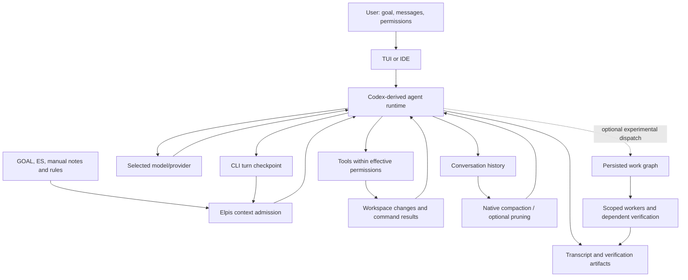
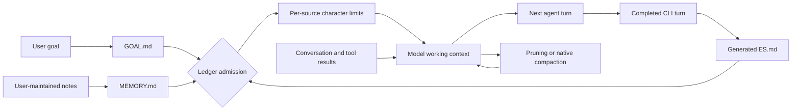

# Elpis Context Sovereignty

Elpis enforces **Context Sovereignty**: the principle that context is a strictly budgeted working set, not a dumped chat transcript. The user maintains live visibility and explicit control over every byte admitted to the agent's context window.
---


## 1. Systemic Role in Elpis

Context management controls the working information supplied to the model. It is
one part of the system; admission, execution permissions, and evidence validation
are different controls.



The model proposes actions; the runtime executes allowed tools and feeds their
results back. More results improve observability but consume context and time.
Pruning reduces selected output while native compaction summarizes history;
either can lose useful detail. The transcript and artifacts remain the place to
verify a shortened claim. A checkpoint carries continuity into later turns, but
can also carry stale assumptions. Admission is a user control, not a truth check.

Elpis's distinctive product direction is this combination of visible admission,
goal continuity, optional pruning and inspectable work graphs around a
Codex-derived runtime. These are implemented additions, not evidence of scientific
novelty or superiority. The model, basic tool loop, native compaction and much of
the interface come from the underlying runtime. A research claim needs controlled
comparisons of task completion, stale-fact errors, latency and total token use.

The existing [work graph](WORK_GRAPHS.md) is experimental and off by default. It
adds task dependencies, bounded write scopes, concurrency control and evidence
requirements. It does not yet fulfill the requested seamless observe/pause/redirect
interface or a general sentinel against duplicate reasoning and wrong decisions.
Those remain the next phase after daily-driver readiness. Scope enforcement can
restrict writes; it cannot prove that a permitted edit is correct.

---

## 2. Three context-control mechanisms and native compaction

Long agent sessions accumulate dead ends, voluminous search results, and repetitive file reads. Elpis separates **working context** from **durable evidence**.

Elpis has three context-control mechanisms. Ace pruning is optional; native Codex compaction
is independent of it rather than a fourth pruning layer or fallback.

| Mechanism | Trigger | Scope | Behavior | Failure Recovery |
| :--- | :--- | :--- | :--- | :--- |
| **RTK filter** | Tool execution | Shell output (`rg`, `git status`, `find`) | Compacts raw command output using pattern filters before the agent sees it. | Fallback to unfiltered output on tool error. |
| **Safety cap** | Tool execution | All raw tool outputs | Hard-truncates exceptionally large output blobs to protect context limits. Inherited from Codex, unchanged. | Preserves header and footer with a truncation notice. |
| **Ace pruning — Experimental** | Explicit `/prune` or `/force-prune`; automatic pressure cycling only when enabled for this conversation | Eligible old tool evidence | Manual actions sweep eligible evidence. Automatic mode targets roughly 20% use, protects the newest 10%, allows at most two back-to-back passes, and seals regions with epoch markers. | A failed pass changes nothing. Native compaction keeps its own threshold/headroom lifecycle. |

RTK is a separate binary: `scripts/install-elpis.sh` installs it alongside Elpis (skip with `ELPIS_SKIP_RTK=1`), and on a launch that finds `rtk` on `PATH` with no `~/.elpis/hooks.json` of your own, Elpis writes the `PreToolUse` hook that calls `rtk hook claude`. It then passes the normal startup hook review before it can run. An existing `hooks.json` is never modified, so `{"hooks":{}}` opts out permanently, and Elpis's hook runtime (`codex-rs/hooks/src/events/pre_tool_use.rs`) is what accepts RTK's rewrite response.

Automatic Ace pruning is **off by default**. `/settings` labels it `Automatic pruning — Experimental` and uses this exact warning: `Distills completed tool output before native compaction. Uses an extra AI call and may slow a turn, reduce prompt cache reuse, or remove useful detail.` Saving that setting affects the **next conversation**, not the already-running one.

`/prune` and `/force-prune <pct>` are explicit manual Ace actions. Both work while automatic
pruning is off. `/force-prune` records `pressure` in its audit to name the targeted selection
strategy; that value does not establish automatic invocation.

`/compact N` saves a pressure threshold for subsequent user turns. Native compaction
runs before a user turn when remaining usable context is at or below N percent.
N may be any finite positive number below 70, including decimals. Settings live
in `compaction.json` in the runtime home; absence preserves the native policy.
The local runtime threshold was changed from 25 to 30 at Masih's request.
This does not enable Smart Prune or automatic memory.

`/compact` immediately runs Codex's native compaction/summarization lifecycle when invoked; it
does not run Ace first. Separately, automatic native compaction uses the donor model-window
threshold and usable-window headroom. The Context Ledger's exact used-token number is
authoritative after either mechanism. Ace saved-token totals are cumulative and origin-neutral:
they do not identify a pass as manual or automatic.

### Ace pass audit trail

Every applied Ace pass writes an immutable audit before the working history changes. If that audit cannot be written, Elpis keeps the working history and does not record the pass as applied.


You do not have to go looking for these: `prune_report.md` renders `ace.json` and `manifest.json` as clickable links (`context_prune_audit.rs`). The audit deliberately omits the system prompt, skills, and transcript, so it stays readable.

---

## 3. Memory and checkpoints



Admission controls what is supplied; it does not judge whether a remembered claim
is still true. GOAL is limited to 6,000 characters, generated ES to 8,000, and
manual MEMORY to 8,000. These are separate limits, not a combined memory budget.
Overlong admitted sources retain their beginning, followed by an ellipsis;
there is no relevance ranking or intelligent consolidation at this boundary.
Stale or repetitive notes can therefore consume attention and reinforce a wrong
assumption. The limits bound size, not this risk. Check current files and runtime
evidence before acting on a checkpoint.

On September 12, this workspace admits GOAL and ES but has manual MEMORY off;
the manual memory file contains only its heading. Continuity here is therefore
primarily the goal, checkpoint, and conversation, not an automatically learned
long-term knowledge base. These local settings can change through the Ledger.

These files have different writers and purposes:

| Source | What actually happens |
| --- | --- |
| `GOAL.md` in Elpis workspace state | Records the explicit goal. Admission is a separate Ledger choice. |
| `ES.md` beside that goal | The CLI replaces it after a completed turn with the latest result, changed-file entries, command entries, and an evidence pointer. It is a checkpoint of that turn, not an accumulated or model-written summary of the whole project. |
| `ES.md` in a repository | Ordinary project notes written by a person or agent. This is a different file; it is not automatically synchronized with the generated checkpoint. |
| `MEMORY.md` in the configured memory directory | User-maintained durable notes, explicitly admitted per workspace. See the Manual Memory controls below. |

The generated checkpoint shares one path per workspace, so the last completed
thread to write it replaces the previous checkpoint. An interrupted turn with no
result, file changes, or commands preserves the same thread's prior checkpoint,
including its original turn and status metadata. Busy turns produce longer
files than short replies. Results are capped at 4,000 characters and each command
at 240 characters while writing; the admitted ES source is capped at 8,000
characters. The checkpoint budgeting correction puts the evidence reference first,
then the latest result, then recent file and command entries that fit. File entries
have a 1,500-character section budget; commands use the remaining space. Omitted
entries are explicitly noted. This deterministic selection is not semantic
consolidation. Earlier installed writers can still leave larger files on disk;
that does not mean the model receives all of them. Finishing or clearing an owning
goal also clears its matching checkpoint.

Ordinary tool output does not automatically expire after every turn. Native
compaction and optional pruning change working history through their own paths.
Persistent files can be loaded again when admitted; their existence does not
establish that the model used them correctly.

We have checks for persistence, admission, and context inclusion, but no completed
paired study proving the quality benefit of the current memory/checkpoint system.
The [continuity comparison protocol](evals/context-continuity/README.md) explicitly
records that its paired provider runs have not been performed. A useful benefit
test must hold model, task, and budget fixed, compare admission on/off after a
restart, and score factual recall, task completion, stale-memory errors, and cost.

### Observed checkpoint pressure, September 12

A read-only inspection at source commit `391ec269` found the generated checkpoint
had 9,604 characters and 41 shell-command entries. Its `Exact Evidence` section
fell outside the first 8,000 characters. This confirms a concrete ordering problem:
old command entries can occupy the admitted space before the evidence pointer.
The separate repository `ES.md` had 52,698 characters; that is manually accumulated
project state, not proof that 52,698 characters were automatically admitted.
These are one-session observations, not a memory-quality score.

Intelligent checkpoint saving remains unfinished. Its acceptance criteria are to
retain the current goal, constraints, unresolved work and evidence locations within
the admission budget, replace superseded facts, and preserve detailed evidence
outside that budget. A comparison must include long command-heavy turns, empty
interruptions, changed facts and competing threads. A summary that merely fits is
insufficient: it must retain the facts required to resume correctly. This work must
not silently re-enable automatic durable-memory promotion or change admission
defaults.

---

### Research boundary: historical real-task evidence

The recovered `terminal-bench-eval` branch contains historical pilot results that
must not be confused with memory evaluation. A September 12 read-only check of the
September 10 CompCert pair found the same binary hash, Terra model, medium effort
and 60,000-token compaction setting in both saved launch records. The raw rollouts
contain one native compaction each. The saved results report both tasks passing:

| Recorded measure | Pruning off | Pruning on |
| --- | ---: | ---: |
| Model requests | 164 | 190 |
| Main-model tokens | 6,091,091 | 6,793,934 |
| Native compactions, recounted from raw rollouts | 1 | 1 |

This single pair does not establish general causality or current-build performance.
The task verdicts and token totals were read from saved results, not independently
rerun; optimizer cost is not included in the main-token row. It does show why gross
pruned tokens cannot be presented as total savings, and why fewer compactions must
be measured rather than assumed. It says nothing about the usefulness of admitted
GOAL, ES or MEMORY. The historical six-pair report also describes mixed results;
its broader statistics have not been independently reproduced here.

Evidence remains under `~/elpis-tb-scratch/compact/compile-compcert-{off,on}/`;
the metadata-only recount is `.tmp/final-candidate/historical-compcert-audit.json`.
The source report is `docs/evals/terminal-bench/PLAN.md` on
`recovery/committed-20260910/terminal-bench-eval`. A paper should separate delivery
correctness, recall quality, task completion, total usage and latency, retaining
negative results and excluding invalid runs. There is no defensible current claim
that Elpis has proven superior memory or uniformly cheaper agent execution.

## 4. Context Ledger (`Tab` / `Alt+C`) & `admission.toml`

Elpis provides interactive context admission control in the TUI:

- **Context Ledger Panel (`Tab` or `Alt+C`):** A side panel shown by default, listing portable context sources with their byte sizes, per-source estimates, and the percentage of the model context window in use. It is 52 columns wide, narrowing to a proportional slice on smaller terminals so the composer keeps room. Tab completes an active composer popup first; otherwise it opens/focuses the ledger, then closes it. `p` toggles Smart Prune while the ledger is focused; Esc returns to editing. Alt+C always toggles visibility. Enter queues a draft during an active reply. With an empty chatbox, Enter interrupts the reply and sends the next queued input; Up recalls all queued inputs for editing. Tab never submits queued messages.
- **`admission.toml` Control:** Toggling a row in the ledger writes `~/.elpis/context/workspaces/<workspace>/admission.toml`, which dynamically governs next-turn admission for:
  - `GOAL.md` (Active Goal)
  - `ES.md` (Executive Summary)
  - Global & project-level `AGENTS.md` rules
  - Individual portable development rules installed by Elpis
    (`~/.elpis/skills/dev/*.md`)

### Saved Full Access

`/yolo` selects Full Access and saves it as the default for future chats in the
current Elpis configuration. This allows unrestricted filesystem/network access
without approval prompts. Explicit project/profile overrides and managed
requirements still apply. `/permissions` can change the current chat's access;
it does not undo the saved `/yolo` default. A save failure is reported explicitly
and leaves Full Access active only for the current chat.

### Terminal appearance

Elpis follows the terminal's foreground and background by default. A terminal
configured to follow the desktop theme therefore switches Elpis with it. Light
backgrounds use darker gold accents and a dark moving highlight; dark backgrounds
retain the orange-yellow palette. `/theme` opens the Codex syntax-theme picker
directly, including live preview and cancel/restore. It changes code highlighting,
not the terminal's base colors. Existing explicit `tui.appearance` overrides remain
supported in configuration; use `appearance = "system"` to follow the terminal.

### Manual memory is explicit

The configured memory directory has one dedicated `MEMORY.md` row. The row remains visible while
its status is loading, missing, available, admitted, being created, or unavailable; Ledger,
`/usage`, and `/dashboard` use the same cached status rather than rereading the file while they
render.

- A missing row cannot be admitted. With that row selected, lowercase `c` creates the minimal
  `MEMORY.md` template and leaves it **not admitted**. Creating the file never opts it into a
  request.
- `Space` or `Enter` explicitly admits or withdraws an existing file for the next request. Bulk
  admission skips Memory while its status or another Memory change is pending.
- Lowercase `p` toggles Smart Prune; it is not a Memory path-copy shortcut.
  Ctrl+click opens a file only after the cached status confirms that a regular file
  exists.
- At most 8,000 trimmed Unicode characters can enter one request. The row reports the next-request
  count, the count that would be eligible if admitted, and whether longer content is truncated.
  Only a Ready, Admitted row contributes its capped estimate to Ledger and `/usage` totals.
- The dashboard receives only phase, admission state, counts, cap, truncation, pending state, and
  a fixed failure code. It never receives the memory path, body, file metadata, or raw I/O error.

After optional template creation, Elpis does not modify or infer the contents of this file. The
user owns the text; Elpis owns only template creation, the explicit admission bit, and the safe
status projection.

### Development rules and curated skills

Development rules and skills have different admission contracts. Development rules are
ordinary Markdown instruction rows in the Context Ledger; they are not skills. This portable
configuration chooses development-rule roots and explicitly enables one skill:

```toml
[skills]
default_enabled = false
dev_rule_roots = ["/absolute/path/to/your/dev-rules"]

[skills.bundled]
enabled = false

[[skills.config]]
name = "one-selected-skill"
enabled = true
```

When `skills.dev_rule_roots` contains one or more roots, those roots replace the managed
development-rule fallback. With no configured roots, including an explicitly empty list, Elpis
uses its managed rule directory and the optional
`ELPIS_DEV_SKILLS_DIRS` additions. Configured roots are read in configuration order; Markdown
files within each root are read in sorted order. The first file with a given filename wins.

Fresh development-rule rows start included. An explicit Ledger exclusion is stored in
`admission.toml` and continues to exclude that row. This default applies to development rules,
not the skills catalog: Elpis product defaults leave ordinary and bundled skills off. Deliberate
user configuration can enable them.

Enabled skills expose compact metadata to the model, while skill bodies remain lazy and are read
only when a selected skill is used. The `/skills` management surface shows enabled skills before
available candidates and labels their origins. Mentions and the model-visible skills list include
enabled skills only. The skills catalog itself is not a Context Ledger token row.


### `/context` — where the window went

The ledger answers *what is admitted*. `/context` answers *what filled the window*: token
usage as a grid broken down by category — user messages, agent responses, tool calls,
system prompt, Development rules, and free space — alongside the backtrack checkpoints available via
`Esc Esc`. The two are separate surfaces and neither replaces the other.


### Context Accounting Contract

Elpis exposes **one single source of truth** for context measurement:

- Displayed percentages explicitly state whether they mean **used** or **remaining**.
- The percentage is computed against the model's own context window — used tokens over context window (`codex-rs/tui/src/chatwidget/context_ledger.rs`) — never against transcript length.
- It is reported in the Context Ledger. The persistent identity header carries product, model, and location only (`Elpis · model {model} · location {cwd}`); the inherited footer status line is deliberately suppressed so there is exactly one place to read the number.
- `/usage` enumerates admitted sources, byte sizes, and lifetime reasons.
- Per-source Ledger counts are capped estimates from trimmed characters divided by four, not
  tokenizer measurements. They make the admitted-file cost inspectable without assigning a
  measured token value to the skills catalog.

---

## 5. Systemic Inter-Dependencies

- **Integration with Sessions:** the admitted `GOAL.md` and `ES.md` sources are exactly what lean continuation carries into a fresh thread; see [Sessions](sessions.md).
- **Integration with Memory:** durable memory is user-managed. Elpis can admit the user's `~/.elpis/memories/MEMORY.md` into context, but it does not automatically extract, consolidate, or promote memories from completed rollouts. A `PreCompact` hook event is available if you want to run your own work at that moment.
- **Integration with Providers:** admitted context is normalized across provider wire formats while evidence pointers are preserved; see [Providers](providers.md).
