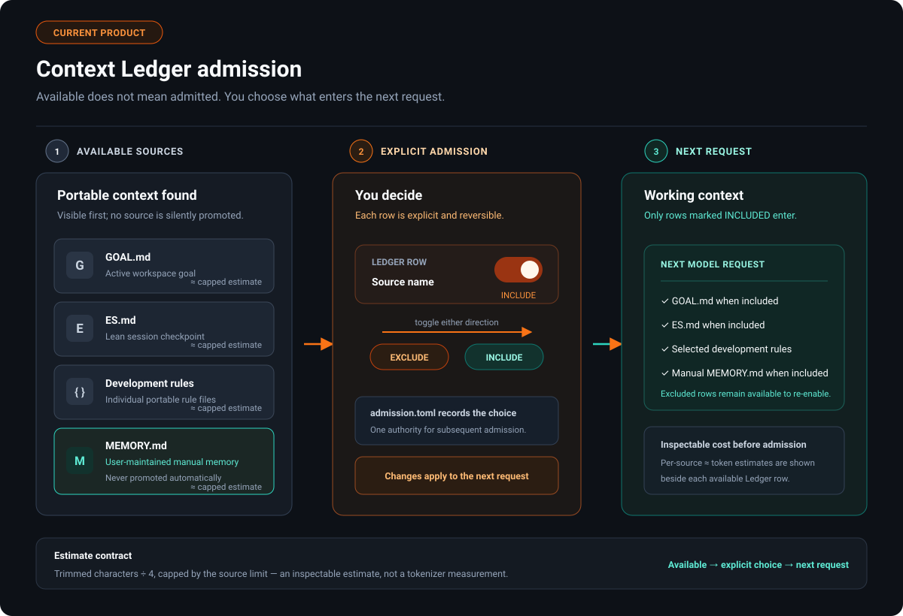

# Elpis Context Sovereignty

Elpis uses **Context Sovereignty**: context is a budgeted working set, not a dumped chat
transcript. The user gets live visibility into total use and explicit admission control over
portable sources; conversation, tool, and built-in context remain governed by the runtime.

---


## 1. Systemic Role in Elpis

Context management acts as the primary gatekeeper between raw workspace/session events and the active model inference loop:

---

## 2. Three context-control mechanisms and native compaction

Long agent sessions accumulate dead ends, voluminous search results, and repetitive file reads. Elpis separates **working context** from **durable evidence**.

Elpis separates prevention from retrospective cleanup. **Smart Prune** is the optional
automatic path: it considers a fresh textual tool result after post-tool hooks finish but
before that result is recorded or sent to the main model for the first time. It may replace
only the result body with a smaller, evidence-linked body. It never removes the tool-call
event, changes its call id, or rewrites an item that has already entered sent history.

`/prune` is a compatibility alias that enables Smart Prune for subsequent turns; it does not
rewrite existing history. `/force-prune <1-100>` remains the explicit emergency Ace pass. It can
rewrite older tool-result bodies on request, which necessarily changes the cacheable prefix after
the first changed item. See [cache-friendly-pruning.md](cache-friendly-pruning.md).

### Pipeline Layer Comparison

| Layer | Trigger | Scope | Behavior | Failure Recovery |
| :--- | :--- | :--- | :--- | :--- |
| **1. RTK Filter** | Before selected shell tools execute | Shell command/request | Rewrites supported commands so the external RTK process can emit a smaller result. RTK is syntactic filtering, not semantic history pruning. | Hook rejection or tool failure leaves normal or unfiltered output available. |
| **2. Safety Cap** | Tool execution | All raw tool outputs | Hard-truncates exceptionally large output blobs to protect context limits. Inherited from Codex, unchanged. | Preserves header and footer with a truncation notice. |
| **3. Smart Prune** | After sibling tools and post-tool hooks, before first main-model exposure, when enabled | Fresh textual function/custom-tool results of at least 1,024 estimated tokens, up to a 24k-token batch | The optimizer returns `compact` or `unchanged` for every result. Elpis admits a compact body only when it saves at least 256 estimated tokens and 20%; the original envelope and call id remain. | Any timeout, malformed response, audit failure, unsupported body, or weak saving admits the exact original result. |
| **4. Explicit recovery** | `/force-prune <1-100>` or `/compact` | Already-recorded history | `/force-prune` selectively rewrites eligible old tool-result bodies; `/compact` performs Codex's broader documented rollover. | Incomplete or invalid decisions leave history unchanged. |

RTK is a separate binary and an optional `PreToolUse` hook. Elpis does not install it. On a
launch that finds a user-installed `rtk` on `PATH` and no user-owned
`~/.elpis/hooks.json`, Elpis writes the hook and subjects it to
the normal startup review. An existing hooks file is never modified, so `{"hooks":{}}`
opts out permanently. Elpis's hook runtime accepts RTK's rewrite response. RTK and Smart
Prune may coexist: RTK changes supported shell execution before it runs; Smart Prune
evaluates the final post-hook result that would otherwise enter model history.

Smart Prune is off by default. Enable it for subsequent turns with `/prune`, or control it with
the Context Ledger's `p` key/switch or `/smart-prune on|off`; the underlying persisted feature key
remains `features.automatic_context_pruning`. A turn captures the setting once, so changing the
configuration cannot change outputs halfway through an active turn. OpenAI-backed admission passes
use Luna at low reasoning effort; other providers use the selected provider model with the same
effort. Each attempt permits up to 60 seconds of optimizer inactivity, with that interval restarting
after every streamed response event. If a first-party Luna request goes inactive or fails at the
model/transport layer, Elpis makes one separately authenticated attempt through OpenRouter's
`openrouter/free` route when `OPENROUTER_API_KEY` is available. A completed but
malformed or unprofitable Luna response does not cross providers. Each attempt has its own audit;
the admission call has a `:smart-prune` prompt-cache namespace and does not consume or replace the
main turn's stable cache key. The fallback sends the same eligible tool-result batch to
OpenRouter, but only after that first-party failure and only when the separate OpenRouter
credential is present.

`/force-prune <pct>` is an explicit emergency Ace action and works while Smart Prune is off.
It records `pressure` in its audit to name the targeted selection strategy; that value does
not establish automatic invocation.

`/compact` immediately runs Codex's native compaction/summarization lifecycle when invoked; it
does not run Ace first. Separately, automatic native compaction uses the donor model-window
threshold and usable-window headroom. The Context Ledger's exact used-token number is
authoritative after either mechanism. Smart Prune saved-token totals are cumulative and origin-neutral:
they do not identify a pass as manual or automatic.

### Audit trail

Every optimizer attempt writes its model, effort, exact optimizer input, raw response or error,
latency, provider usage when reported, and outcome to
`~/.elpis/logs/smart-prune/attempts/<attempt-id>.json`. Before a compact body can enter history, the
admission also writes its exact source, admitted envelope, source hash, and model decision under
`~/.elpis/logs/smart-prune/admissions/<admission-id>/`. Elpis later appends hash-only main-request
linkage and the matching response id/usage. If the admission audit cannot be written, Elpis admits
the original output. Manual Ace passes retain their existing immutable pruning audit. This behavior
is implemented but remains under live acceptance until three consecutive admissions and one
deliberate fail-open case are observed in an installed build.


For manual Ace, `prune_report.md` renders `ace.json` and `manifest.json` as clickable
links (`context_prune_audit.rs`). Those manual reports deliberately omit the system prompt,
skills, and transcript so they stay readable.

---

## 3. What persists

Context Ledger settings decide which portable files enter subsequent requests. Conversation
history, including admitted tool results, otherwise remains model-visible until a real lifecycle
event changes it: native compaction, explicit `/force-prune`, backtracking, or a new/forked
session. Smart Prune chooses a fresh result's first admitted form and does not revisit it later.
Rollout and audit files preserve evidence separately from the active model context.

---

## 4. Context Ledger (`Tab` / `Alt+C`) & `admission.toml`

Elpis provides interactive context admission control in the TUI:

- **Context Ledger Panel (`Tab` or `Alt+C`):** A side panel shown by default. Its single full-window bar and category estimates use the same accounting as `/context`: user messages, agent messages, reasoning, tool calls/results, system/developer instructions, tool definitions/schema, and unrecognized items. Category allocation is estimated, not a provider breakdown. Completed assistant responses refresh the retained-history snapshot. Pending source choices are labelled separately; toggling does not prematurely subtract tokens from measured usage. The source section lists portable context files with byte sizes and per-source estimates. The panel is 52 columns wide, narrowing on smaller terminals. While a turn is running, `Tab` queues the draft; `Alt+C` always toggles the ledger.
- **`admission.toml` Control:** Toggling a row in the ledger writes `~/.elpis/context/workspaces/<workspace>/admission.toml`, which dynamically governs next-turn admission for:
  - `GOAL.md` (Active Goal)
  - `ES.md` (Executive Summary)
  - Global & project-level `AGENTS.md` rules
  - Individual portable development rules installed by Elpis
    (`~/.elpis/skills/dev/*.md`)

### Development rules and curated skills

Development rules and skills have different admission contracts. Development rules are
ordinary Markdown instruction rows in the Context Ledger; they are not skills. This portable
configuration chooses development-rule roots and explicitly enables one skill:

```toml
[skills]
default_enabled = false
dev_rule_roots = ["/absolute/path/to/your/dev-rules"]

[skills.bundled]
enabled = false

[[skills.config]]
name = "one-selected-skill"
enabled = true
```

When `skills.dev_rule_roots` contains one or more roots, those roots replace the managed
development-rule fallback. With no configured roots, including an explicitly empty list, Elpis
uses its managed rule directory and the optional
`ELPIS_DEV_SKILLS_DIRS` additions. Configured roots are read in configuration order; Markdown
files within each root are read in sorted order. The first file with a given filename wins.

Fresh development-rule rows start included. An explicit Ledger exclusion is stored in
`admission.toml` and continues to exclude that row. This default applies to development rules,
not the skills catalog: Elpis product defaults leave ordinary and bundled skills off. Deliberate
user configuration can enable them.

Enabled skills expose compact metadata to the model, while skill bodies remain lazy and are read
only when a selected skill is used. The `/skills` management surface shows enabled skills before
available candidates and labels their origins. Mentions and the model-visible skills list include
enabled skills only. The skills catalog itself is not a Context Ledger token row.



### Manual memory is explicit

The `MEMORY.md` row is ordinary user-controlled context, not an automatic memory system.
If the row says the file is missing, select it and press `c` to create an empty memory file;
creation does not admit it. Press `Space` or `Enter` to include or exclude an existing file.
The Ledger updates immediately during an active turn, while the context change takes effect
on the next model request. At most 8,000 characters are admitted, and the Ledger shows the
state and capped estimate without exposing the file contents or path.

### `/context` — where the window went

The Ledger persistently summarizes both *how much of the window is occupied* and *which portable
sources are admitted*. `/context` expands the same accounting into one segmented bar with free space,
backtrack checkpoints available via `Esc Esc`, and local evidence links. Both surfaces use the
same category function, marker shapes, and distinct colors for the latest request-composition
estimate.

The occupied width comes from core's current context measurement. Category proportions are locally
estimated from retained request history, refreshed after a completed response using the same
static instructions and tool definitions, then proportionally reconciled to that measured total.
This allocation is Elpis-specific; the Hermes reference supplies a full-window display and usage
anchor, not this proportional reconciliation. This is explicitly labelled as
estimated attribution, not a provider breakdown. The unfilled width is the measured free capacity;
there is no fabricated gap category. Before a request snapshot exists, the Ledger says the breakdown
is unavailable instead of fabricating zero-token categories.

### Context Accounting Contract

Elpis exposes **one single source of truth** for context measurement:

- Displayed percentages explicitly state whether they mean **used** or **remaining**.
- The percentage is computed against the model's own context window — used tokens over context window (`codex-rs/tui/src/chatwidget/context_ledger.rs`) — never against transcript length.
- It is reported in the Context Ledger. The persistent identity header carries product, model, and location only (`Elpis · model {model} · location {cwd}`); the inherited footer status line is deliberately suppressed so there is exactly one place to read the number.
- `/context`, the dashboard, and the Ledger use the same category-attribution function for the exact latest built request. Its estimated proportions are reconciled to the independently measured active total, so the rows, colored width, and headline agree without inventing a remainder category.
- `/usage` enumerates admitted sources, byte sizes, and lifetime reasons.
- Per-source Ledger counts are capped estimates from trimmed characters divided by four, not
  tokenizer measurements. They make the admitted-file cost inspectable without assigning a
  measured token value to the skills catalog.

---

## 5. Systemic Inter-Dependencies

- **Integration with Sessions:** the admitted `GOAL.md` and `ES.md` sources are exactly what lean continuation carries into a fresh thread; see [Sessions](sessions.md).
- **Integration with Memory:** durable memory is user-managed. Elpis can admit the user's `~/.elpis/memories/MEMORY.md` into context, but it does not automatically extract, consolidate, or promote memories from completed rollouts. A `PreCompact` hook event is available if you want to run your own work at that moment.
- **Integration with Providers:** admitted context is normalized across provider wire formats while evidence pointers are preserved; see [Providers](providers.md).
