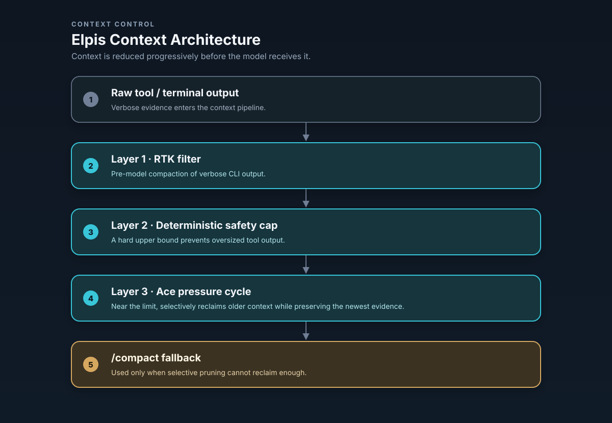
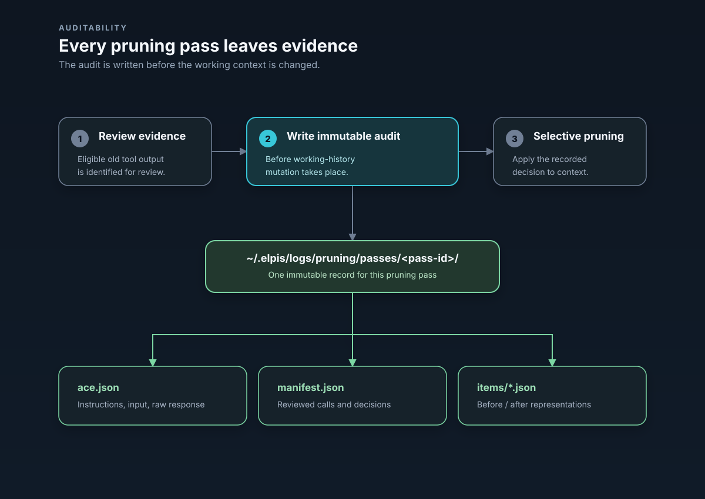

# Elpis Context Sovereignty

Elpis enforces **Context Sovereignty**: the principle that context is a strictly budgeted working set, not a dumped chat transcript. The user maintains live visibility and explicit control over every byte admitted to the agent's context window.
---



## 1. Systemic Role in Elpis

Context management acts as the primary gatekeeper between raw workspace/session events and the active model inference loop:

---

## 2. Three context-control mechanisms and native compaction

Long agent sessions accumulate dead ends, voluminous search results, and repetitive file reads. Elpis separates **working context** from **durable evidence**.

Elpis has three context-control mechanisms. Ace pruning is optional; native Codex compaction
is independent of it rather than a fourth pruning layer or fallback.

| Mechanism | Trigger | Scope | Behavior | Failure Recovery |
| :--- | :--- | :--- | :--- | :--- |
| **RTK filter** | Tool execution | Shell output (`rg`, `git status`, `find`) | Compacts raw command output using pattern filters before the agent sees it. | Fallback to unfiltered output on tool error. |
| **Safety cap** | Tool execution | All raw tool outputs | Hard-truncates exceptionally large output blobs to protect context limits. Inherited from Codex, unchanged. | Preserves header and footer with a truncation notice. |
| **Ace pruning — Experimental** | Explicit `/prune` or `/force-prune`; automatic pressure cycling only when enabled for this conversation | Eligible old tool evidence | Manual actions sweep eligible evidence. Automatic mode targets roughly 20% use, protects the newest 10%, allows at most two back-to-back passes, and seals regions with epoch markers. | A failed pass changes nothing. Native compaction keeps its own threshold/headroom lifecycle. |

RTK is a separate binary: `scripts/install-elpis.sh` installs it alongside Elpis (skip with `ELPIS_SKIP_RTK=1`), and on a launch that finds `rtk` on `PATH` with no `~/.elpis/hooks.json` of your own, Elpis writes the `PreToolUse` hook that calls `rtk hook claude`. It then passes the normal startup hook review before it can run. An existing `hooks.json` is never modified, so `{"hooks":{}}` opts out permanently, and Elpis's hook runtime (`codex-rs/hooks/src/events/pre_tool_use.rs`) is what accepts RTK's rewrite response.

Automatic Ace pruning is **off by default**. `/settings` labels it `Automatic pruning — Experimental` and uses this exact warning: `Distills completed tool output before native compaction. Uses an extra AI call and may slow a turn, reduce prompt cache reuse, or remove useful detail.` Saving that setting affects the **next conversation**, not the already-running one.

`/prune` and `/force-prune <pct>` are explicit manual Ace actions. Both work while automatic
pruning is off. `/force-prune` records `pressure` in its audit to name the targeted selection
strategy; that value does not establish automatic invocation.

`/compact` immediately runs Codex's native compaction/summarization lifecycle when invoked; it
does not run Ace first. Separately, automatic native compaction uses the donor model-window
threshold and usable-window headroom. The Context Ledger's exact used-token number is
authoritative after either mechanism. Ace saved-token totals are cumulative and origin-neutral:
they do not identify a pass as manual or automatic.

### Ace pass audit trail

Every applied Ace pass writes an immutable audit before the working history changes. If that audit cannot be written, Elpis keeps the working history and does not record the pass as applied.



You do not have to go looking for these: `prune_report.md` renders `ace.json` and `manifest.json` as clickable links (`context_prune_audit.rs`). The audit deliberately omits the system prompt, skills, and transcript, so it stays readable.

---

## 3. Context Lifetimes

Every item admitted into Elpis context carries an explicit lifetime:

```text
+-----------------------------------------------------------------------------------+
| DURABLE LIFETIME                                                                 |
| - AGENTS.md rules, active GOAL.md, MEMORY.md, explicit user constraints           |
+-----------------------------------------------------------------------------------+
                                         |
                                         v
+-----------------------------------------------------------------------------------+
| TASK LIFETIME                                                                     |
| - Decisions, changed file paths, blockers, verification, ES.md checkpoint         |
+-----------------------------------------------------------------------------------+
                                         |
                                         v
+-----------------------------------------------------------------------------------+
| TURN LIFETIME (Expires after turn question is answered)                           |
| - Terminal reads, searches, directory listings, command probes, temporary diffs   |
+-----------------------------------------------------------------------------------+
```

1. **Durable:** Survives across compaction, model switches, and restarts.
2. **Task:** Survives across turn execution within the current task; summarized into `ES.md` upon task transition.
3. **Turn:** Expires immediately after the active turn question is answered. Raw output is evicted from working context, leaving behind an exact evidence pointer (rollout ID / log path).

---

## 4. Context Ledger (`Tab` / `Alt+C`) & `admission.toml`

Elpis provides interactive context admission control in the TUI:

- **Context Ledger Panel (`Tab` or `Alt+C`):** A side panel shown by default, listing portable context sources with their byte sizes, per-source estimates, and the percentage of the model context window in use. It is 52 columns wide, narrowing to a proportional slice on smaller terminals so the composer keeps room. While a turn is running, `Tab` defers to the composer's queue-the-draft action; `Alt+C` always toggles the ledger.
- **`admission.toml` Control:** Toggling a row in the ledger writes `~/.elpis/context/workspaces/<workspace>/admission.toml`, which dynamically governs next-turn admission for:
  - `GOAL.md` (Active Goal)
  - `ES.md` (Executive Summary)
  - Global & project-level `AGENTS.md` rules
  - Individual portable development rules installed by Elpis
    (`~/.elpis/skills/dev/*.md`)

### Manual memory is explicit

The configured memory directory has one dedicated `MEMORY.md` row. The row remains visible while
its status is loading, missing, available, admitted, being created, or unavailable; Ledger,
`/usage`, and `/dashboard` use the same cached status rather than rereading the file while they
render.

- A missing row cannot be admitted. With that row selected, lowercase `c` creates the minimal
  `MEMORY.md` template and leaves it **not admitted**. Creating the file never opts it into a
  request.
- `Space` or `Enter` explicitly admits or withdraws an existing file for the next request. Bulk
  admission skips Memory while its status or another Memory change is pending.
- Lowercase `p` copies the exact configured `MEMORY.md` path. It does not open an editor or file
  manager. Ctrl+click opens a file only after the cached status confirms that a regular file
  exists.
- At most 8,000 trimmed Unicode characters can enter one request. The row reports the next-request
  count, the count that would be eligible if admitted, and whether longer content is truncated.
  Only a Ready, Admitted row contributes its capped estimate to Ledger and `/usage` totals.
- The dashboard receives only phase, admission state, counts, cap, truncation, pending state, and
  a fixed failure code. It never receives the memory path, body, file metadata, or raw I/O error.

After optional template creation, Elpis does not modify or infer the contents of this file. The
user owns the text; Elpis owns only template creation, the explicit admission bit, and the safe
status projection.

### Development rules and curated skills

Development rules and skills have different admission contracts. Development rules are
ordinary Markdown instruction rows in the Context Ledger; they are not skills. This portable
configuration chooses development-rule roots and explicitly enables one skill:

```toml
[skills]
default_enabled = false
dev_rule_roots = ["/absolute/path/to/your/dev-rules"]

[skills.bundled]
enabled = false

[[skills.config]]
name = "one-selected-skill"
enabled = true
```

When `skills.dev_rule_roots` contains one or more roots, those roots replace the managed
development-rule fallback. With no configured roots, including an explicitly empty list, Elpis
uses its managed rule directory and the optional
`ELPIS_DEV_SKILLS_DIRS` additions. Configured roots are read in configuration order; Markdown
files within each root are read in sorted order. The first file with a given filename wins.

Fresh development-rule rows start included. An explicit Ledger exclusion is stored in
`admission.toml` and continues to exclude that row. This default applies to development rules,
not the skills catalog: Elpis product defaults leave ordinary and bundled skills off. Deliberate
user configuration can enable them.

Enabled skills expose compact metadata to the model, while skill bodies remain lazy and are read
only when a selected skill is used. The `/skills` management surface shows enabled skills before
available candidates and labels their origins. Mentions and the model-visible skills list include
enabled skills only. The skills catalog itself is not a Context Ledger token row.


### `/context` — where the window went

The ledger answers *what is admitted*. `/context` answers *what filled the window*: token
usage as a grid broken down by category — user messages, agent responses, tool calls,
system prompt, Development rules, and free space — alongside the backtrack checkpoints available via
`Esc Esc`. The two are separate surfaces and neither replaces the other.


### Context Accounting Contract

Elpis exposes **one single source of truth** for context measurement:

- Displayed percentages explicitly state whether they mean **used** or **remaining**.
- The percentage is computed against the model's own context window — used tokens over context window (`codex-rs/tui/src/chatwidget/context_ledger.rs`) — never against transcript length.
- It is reported in the Context Ledger. The persistent identity header carries product, model, and location only (`Elpis · model {model} · location {cwd}`); the inherited footer status line is deliberately suppressed so there is exactly one place to read the number.
- `/usage` enumerates admitted sources, byte sizes, and lifetime reasons.
- Per-source Ledger counts are capped estimates from trimmed characters divided by four, not
  tokenizer measurements. They make the admitted-file cost inspectable without assigning a
  measured token value to the skills catalog.

---

## 5. Systemic Inter-Dependencies

- **Integration with Sessions:** the admitted `GOAL.md` and `ES.md` sources are exactly what lean continuation carries into a fresh thread; see [Sessions](sessions.md).
- **Integration with Memory:** durable memory is user-managed. Elpis can admit the user's `~/.elpis/memories/MEMORY.md` into context, but it does not automatically extract, consolidate, or promote memories from completed rollouts. A `PreCompact` hook event is available if you want to run your own work at that moment.
- **Integration with Providers:** admitted context is normalized across provider wire formats while evidence pointers are preserved; see [Providers](providers.md).
