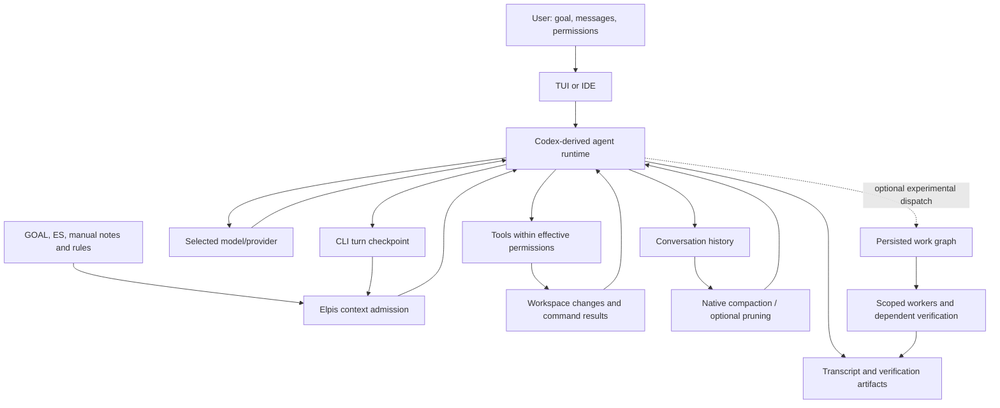
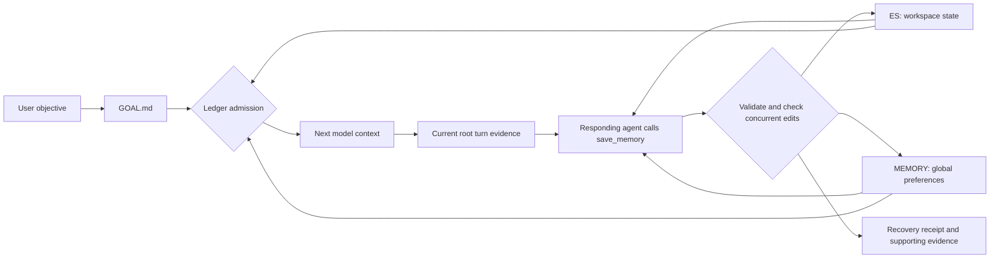

# Elpis Context Sovereignty

Elpis exposes controls for admitting project notes and continuity files, pruning
tool output, and compacting conversation history. The Context Ledger shows these
sources and their budgets; it is not a complete inspector of every provider-request byte.
---


## 1. Systemic Role in Elpis

Context management controls the working information supplied to the model. It is
one part of the system; admission, execution permissions, and evidence validation
are different controls.



The model proposes actions; the runtime executes allowed tools and feeds their
results back. More results improve observability but consume context and time.
Pruning reduces selected output while native compaction summarizes history;
either can lose useful detail. The transcript and artifacts remain the place to
verify a shortened claim. A checkpoint carries continuity into later turns, but
can also carry stale assumptions. Admission is a user control, not a truth check.

Elpis's distinctive product direction is this combination of visible admission,
goal continuity, optional pruning and inspectable work graphs around a
Codex-derived runtime. These are implemented additions, not evidence of scientific
novelty or superiority. The model, basic tool loop, native compaction and much of
the interface come from the underlying runtime. A research claim needs controlled
comparisons of task completion, stale-fact errors, latency and total token use.

The existing [work graph](WORK_GRAPHS.md) is experimental and off by default. It
adds task dependencies, bounded write scopes, concurrency control and evidence
requirements. It does not yet fulfill the requested seamless observe/pause/redirect
interface or a general sentinel against duplicate reasoning and wrong decisions.
Those remain the next phase after daily-driver readiness. Scope enforcement can
restrict writes; it cannot prove that a permitted edit is correct.

---

## 2. Three context-control mechanisms and native compaction

Long agent sessions accumulate dead ends, voluminous search results, and repetitive file reads. Elpis separates **working context** from **durable evidence**.

Elpis has three context-control mechanisms. Ace pruning is optional; native Codex compaction
is independent of it rather than a fourth pruning layer or fallback.

| Mechanism | Trigger | Scope | Behavior | Failure Recovery |
| :--- | :--- | :--- | :--- | :--- |
| **RTK filter** | Tool execution | Shell output (`rg`, `git status`, `find`) | Compacts raw command output using pattern filters before the agent sees it. | Fallback to unfiltered output on tool error. |
| **Safety cap** | Tool execution | All raw tool outputs | Hard-truncates exceptionally large output blobs to protect context limits. Inherited from Codex, unchanged. | Preserves header and footer with a truncation notice. |
| **Ace pruning — Experimental** | Explicit `/prune` or `/force-prune`; automatic pressure cycling only when enabled for this conversation | Eligible old tool evidence | Manual actions sweep eligible evidence. Automatic mode targets roughly 20% use, protects the newest 10%, allows at most two back-to-back passes, and seals regions with epoch markers. | A failed pass changes nothing. Native compaction keeps its own threshold/headroom lifecycle. |

RTK is a separate binary: `scripts/install-elpis.sh` installs it alongside Elpis (skip with `ELPIS_SKIP_RTK=1`), and on a launch that finds `rtk` on `PATH` with no `~/.elpis/hooks.json` of your own, Elpis writes the `PreToolUse` hook that calls `rtk hook claude`. It then passes the normal startup hook review before it can run. An existing `hooks.json` is never modified, so `{"hooks":{}}` opts out permanently, and Elpis's hook runtime (`codex-rs/hooks/src/events/pre_tool_use.rs`) is what accepts RTK's rewrite response.

Automatic Ace pruning is **off by default**. `/settings` labels it `Automatic pruning — Experimental` and uses this exact warning: `Distills completed tool output before native compaction. Uses an extra AI call and may slow a turn, reduce prompt cache reuse, or remove useful detail.` Saving that setting affects the **next conversation**, not the already-running one.

`/prune` and `/force-prune <pct>` are explicit manual Ace actions. Both work while automatic
pruning is off. `/force-prune` records `pressure` in its audit to name the targeted selection
strategy; that value does not establish automatic invocation.

`/compact N` saves a pressure threshold checked before user turns and between
model/tool iterations during ongoing work. When remaining usable context is at
or below N percent, native compaction runs before the next continuing model request.
It respects the automatic-compaction toggle. If a compaction cannot get below the
custom target, that ongoing turn suppresses repeated pressure compactions until
context falls below the target; native context-limit protection remains active.
N may be any finite positive number below 70, including decimals. Settings live
in `compaction.json` in the runtime home; absence preserves the native policy.
The local runtime threshold was changed from 25 to 30 at Masih's request.
This does not enable Smart Prune or automatic memory.

`/compact` immediately runs Codex's native compaction/summarization lifecycle when invoked; it
does not run Ace first. Separately, automatic native compaction uses the donor model-window
threshold and usable-window headroom. The Context Ledger's exact used-token number is
authoritative after either mechanism. Ace saved-token totals are cumulative and origin-neutral:
they do not identify a pass as manual or automatic.

### Ace pass audit trail

Every applied Ace pass writes an immutable audit before the working history changes. If that audit cannot be written, Elpis keeps the working history and does not record the pass as applied.


You do not have to go looking for these: `prune_report.md` renders `ace.json` and `manifest.json` as clickable links (`context_prune_audit.rs`). The audit deliberately omits the system prompt, skills, and transcript, so it stays readable.

---

## 3. Memory and checkpoints

The memory loop has three human-readable files and one admission control. It does
not require an embedding service, vector database, or autonomous memory agent.

In plain terms: **GOAL says what to achieve; ES says where work stands; MEMORY
says what should help next time.** When workspace saving is enabled, the responding
root agent can call a guarded local tool before its final answer. The Ledger then
decides whether later requests receive the saved files. Format validation cannot
prove that a lesson is true or that the model will apply it to the correct project.

For example, “use literal checklists” is a reusable preference; “this project's
generic test skips parser fixtures” is project state; “the build is running”
is temporary ES state. A verified correction should replace the obsolete lesson.
An agent's untested guess should not become a fact. These are the saving policy,
not guarantees established by the current implementation.



| Source | Purpose and writer | Scope and admission limit |
| --- | --- | --- |
| `GOAL.md` | Explicit objective and goal state; the goal runtime owns it. `save_memory` does not rewrite the objective. | Workspace, 6,000 characters |
| Generated `ES.md` | Current decisions, unfinished work, verification, blockers and next action. The CLI writes turn details; enabled `save_memory` can replace its consolidated state. Later same-thread CLI writes retain that consolidated state. | Workspace, 8,000 characters |
| `MEMORY.md` | Explicit, stable global user preferences. Users can edit it; enabled `save_memory` can apply exact append, replace, or remove edits without replacing unseen text. | Shared memory directory, 8,000 characters |
| Repository `ES.md` | Ordinary project notes maintained by a person or agent. It is a separate file from the generated checkpoint. | Ordinary file admission, when selected |

A correction belongs in memory when it teaches a reusable lesson: what was
misunderstood, the correction, and when it applies. Current progress and unfinished
tasks and project-specific lessons belong in ES; the objective belongs in GOAL.
There is one shared memory file, not a separate memory database per project, so
agent-saved MEMORY content is limited to global preferences. These labels
and the admission prompt guide the model, so scope still needs behavioral testing.

**Saving and loading are independent.** A workspace opts into saving through
`context/workspaces/<workspace>/memory-autosave.json` containing
`{"enabled":true}`. The Ledger's Memory row controls whether saved notes enter a
request. Neither switch implies the other. The implementation remains off unless
explicitly enabled. Saving does not enable admission, and admission does not enable
saving.

When enabled for a root conversation, the runtime offers the responding agent a
`save_memory` tool in its normal tool loop. There is no post-response,
pre-compaction, background-model, or other auxiliary save request. The agent calls
the tool before its final answer when durable state changed; if it does not call
the tool, nothing is saved. Internal, review, and subagent sessions cannot receive
or invoke it. The runtime fixes the memory root and workspace paths; the caller
cannot choose a write path.

The tool accepts exact edits to `MEMORY.md` and either a complete replacement for
ES's Consolidated State or no ES change. The runtime captures the previous
MEMORY/ES state at the start of that turn and applies exact edits to the locked
snapshot, preserving content the agent did not change. New output is capped at
6,000 characters. Recovery receipts retain the old and proposed state plus up to
64,000 characters of current-turn
user and assistant evidence; half of that evidence capacity is reserved for user
messages so a large assistant response cannot displace the correction being saved.

The runtime rechecks the saving opt-in and fixed paths, acquires the global memory
and workspace checkpoint locks, and rejects invalid or oversized content, empty ES,
attempted erasure of existing memory, unsupported evidence citations, or any
MEMORY/ES change since the turn began. Each save records prepared/committed state
in a unique recovery receipt. Individual file replacements are atomic; the
two-file update is not a crash-atomic transaction. A failed tool call returns the
failure to the responding agent for explicit disclosure. Existing manual edits
detected before commit reject the stale turn snapshot; the locks coordinate Elpis
writers but cannot make unrelated writers cooperate.

Memory persistence converts full session/turn evidence citations into stable
numeric references. Their full identifiers are retained in
`memories/memory-references/sources.md`; receipts retain both the model's original
memory output and the text actually saved. Existing short citations and unrelated
text are preserved. Provenance is written before the shortened memory, so a failed
save can leave unused references but cannot publish a new reference before its
source. This formats citations; it does not verify the cited claim or fix semantic
retention and project scoping.

Before saving, UUID-based citations must match supplied conversation evidence,
previous notes, or retained provenance. An unsupported or damaged identifier
rejects the update before notes or provenance are written. Existing provenance is
trusted rather than retroactively repaired; numeric references and the truth of
the associated claim are not verified by this guard.

For an unchanged line ending in registered numeric references, a separate check
rejects replacing or removing its existing support. Additional registered support
is allowed. This check does not validate rewritten prose or interior citations;
ordinary bracketed values coinciding with registered labels remain ambiguous.

ES can dilute attention: length limits bound context use, not truth or relevance.
The shared workspace checkpoint also remains subject to the last thread writer.
Model summaries can omit facts or preserve bad assumptions. Receipts support
inspection; they do not prove semantic fidelity. The live memory file previously
stayed heading-only because automatic promotion had been removed and Memory
admission was off. Merely creating the file could not make it learn.

The candidate runtime check is `node scripts/memory-runtime.test.cjs` against a
built app-server. It covers the responding agent's tool call, guarded MEMORY/ES
writes, absence of an auxiliary request, saving/admission independence, and
disabled behavior. Focused Rust tests cover stale baselines, concurrent edits,
root-only access, exact edits, limits, and evidence attribution. These checks are
not functional acceptance, and the replacement remains unverified until Masih
accepts its user-visible behavior. Live-model recall and correction checks remain
separate from plumbing tests. Neither establishes a general improvement in coding
quality, lower total cost, or scientific novelty.

OpenClaw documents a pre-compaction memory flush and a separate promotion process.
Jcode describes embedding turns and retrieving related memories from a graph.
Elpis takes the smaller file-consolidation approach here; it is not an
implementation of Jcode's retrieval architecture. Sources:
[OpenClaw memory](https://docs.openclaw.ai/concepts/memory),
[Jcode memory description](https://jcode.sh/#a-good-built-in-memory-system).

### Historical Luna behavior, verified September 13 and no longer current

The retired Luna implementation's local fake-provider runtime test passed response-completion saving,
pre-compaction saving, receipt evidence, restart admission, malformed-output
preservation, concurrent manual-edit protection, and disabled behavior.
The previous installed runtime failed the new response-completion assertion,
demonstrating that the check detects the missing trigger.

A separate Luna-only live test saved a fictional project's port as 44713,
corrected it to 44719, restarted the app-server, and obtained 44719 from admitted
memory. With both Memory and ES admission disabled in another fresh thread, the
same query returned UNKNOWN. Saving turns took 8.47 and 7.83 seconds including
the main acknowledgement and memory call; recall/control turns took 3.31 and
3.62 seconds. This is a small factual-recall control, not a general benchmark.
Evidence: `.tmp/final-candidate/memory-live-runtime-result.json` and
`.tmp/final-candidate/memory-completion-runtime.log`.

At that time, Elpis workspace saving and Memory admission were enabled locally. Six explicit
user preferences were consolidated by Luna in an isolated bootstrap, reviewed,
and copied into the actual MEMORY file; synthetic test facts were not promoted.
The saved notes cover Luna-only memory, simplicity, literal checklists, user-led
launching, queue editing, and usage-window dismissal. Bootstrap source and recovery
records are under `~/.elpis/memory-bootstrap/1789282684322/`.

Installed CLI SHA256:
`6d47e53a1012c26cdff54438d369be7f2f8f3dfe0d1fb556287248f9f749ebd7`.
The running process must restart to acquire the response-completion trigger.
Other workspaces remain opt-in. The installed IDE extension 0.1.20's bundled
app-server was updated locally; stripped runtime SHA256:
`e3d9f9e86298b10ca17e765f696d47f4174f73588e411685ecaaf22320d78a85`.
The runtime memory fixture passed on that artifact. Recovery binaries are in
`~/.local/share/elpis/release-recovery/scroll-memory-20260913/`.
The final TUI suite passed 3,195 tests with five ignored, including root checkpoint
ownership and Usage dismissal; `.tmp/final-candidate/wheel-memory-tui-tests.log`.
General memory benefit and final user acceptance remain open.

The resumed primary conversation subsequently produced a committed Luna save
receipt on September 13. This establishes that the installed response-completion
trigger runs in the actual workspace, beyond the isolated tests. It does not mean
every response should add a new memory: unchanged durable notes are an explicit
valid result, while temporary work belongs in ES.

### Memory search and agent-owned saving are separate

Saved memories are activated by the user clicking or toggling
`MEMORY.md` in the Context Ledger. Saving and activation are separate: the
Ledger controls whether the saved file is supplied to later requests. Turning
it off does not erase the saved file or remove text from previous requests.

The configured RAG MCP can search `MEMORY.md` using API embeddings and its local
index. This does not change the saver or Ledger admission: the responding agent
still owns explicit saves, and admitting Memory still supplies the file rather
than automatically selecting passages with RAG. Retrieved passages become context when the agent
calls the search tool. Vectors help locate text; they do not expand the context
window or establish that a saved claim is true.

A September 13 local comparison used the same two queries over the memory file
and 32 RAG Python source files (389 source passages), excluding generated book
indexes. API `qwen/qwen3-embedding-4b` and local MiniLM both retrieved relevant
index-lifecycle safeguards, with unrelated passages also returned. No clear API
quality improvement was demonstrated. Both returned almost the entire small
memory file, so this case showed no memory-context saving. Raw inputs, source
hashes and results are in `.tmp/rag-api-eval/`; this is a small diagnostic, not a
general RAG benchmark.

### Testing useful lessons

Masih's September 13 clarification emphasizes verified, reusable lessons that
prevent repeated mistakes. The current categories remain provisional while he
decides which information should persist. Agent-owned saving is a persistence mechanism,
not permission to retain every conversation detail.

A useful evaluation tests behavior, not just file population:

- Establish a concrete lesson with a verified outcome; inspect the saved note for
  the triggering situation, mistake and corrective action, with its evidence.
- Start a fresh chat and present a related task without repeating the lesson.
  Check the resulting action, not merely whether the assistant can quote the note.
- Repeat in an isolated home with memory and checkpoint admission disabled;
  compare the same task and model. Avoid contaminating the control with ES.
- Correct the lesson and restart again. Require the corrected behavior and no
  conflicting obsolete rule. Check an unrelated task for inappropriate application.
- Verify transient progress, guesses and untrusted instructions are not promoted.

The September 13 execution of the
[lesson acceptance draft](evals/memory-lessons-review.md) saved a project lesson,
kept temporary progress in ES, changed the recommended action with admission
enabled, and followed a corrected recommendation. However, it also applied Copper
Orchard's project-specific lesson to unrelated Silver Meadow. That scope control
failed: populated memory and successful recall do not establish reliable judgment.
Raw results are in `.tmp/final-candidate/memory-lessons-live-result.json`.
The candidate adds explicit scope guidance and an admission regression test.
The one-request replay still failed: Luna recommended Copper Orchard's command
for Silver Meadow, despite receiving the guidance in the actual developer context.
Saving is verified; reliable semantic project scoping is not. The isolated probe
asks about another project within the same working directory, so separating files
by workspace alone would not establish that this particular error is fixed.

### Memory and compaction timing, September 13

Three actual workspace responses took another 24.276, 26.092 and 25.924 seconds
after their final text before the turn completed. Their committed memory receipts
were written 3–4 milliseconds before completion. This measures the combined
post-answer saving delay; it does not isolate Luna inference from local work.
The older receipts have no duration fields, and the last recorded compaction
predates those saves, so these observations cannot explain earlier multi-minute
compactions.

The candidate adds preparation, request and commit milliseconds to future memory
receipts. Commit timing ends before the final receipt write. Existing logs also
record remote compaction's pre-hooks, preparation, request, history application
and post-hooks as scalar durations. Request timing includes the client/network
lifecycle, not just provider inference. This instrumentation supplies evidence
for diagnosis; it is not a speed fix. The saved pressure threshold remains
30% context remaining.

### Observed checkpoint pressure, September 12

A read-only inspection at source commit `391ec269` found the generated checkpoint
had 9,604 characters and 41 shell-command entries. Its `Exact Evidence` section
fell outside the first 8,000 characters. This confirms a concrete ordering problem:
old command entries can occupy the admitted space before the evidence pointer.
The separate repository `ES.md` had 52,698 characters; that is manually accumulated
project state, not proof that 52,698 characters were automatically admitted.
These are one-session observations, not a memory-quality score.

The root project checkpoint was subsequently consolidated manually from 58,967 to
4,436 characters, replacing accumulated contradictory status blocks with current
state, constraints, evidence links and remaining work. Earlier notes are retained
outside the active file in `.tmp/final-candidate/root-es-before-consolidation.md`.
The active task checklist was consolidated similarly. This is maintenance of
agent-written project notes, not an automatic semantic-memory capability or a
measured improvement in model decisions.

Semantic checkpoint saving still requires evidence of fidelity. Its acceptance criteria are to
retain the current goal, constraints, unresolved work and evidence locations within
the admission budget, replace superseded facts, and preserve detailed evidence
outside that budget. A comparison must include long command-heavy turns, empty
interruptions, changed facts and competing threads. A summary that merely fits is
insufficient: it must retain the facts required to resume correctly. This work must
not silently re-enable automatic durable-memory promotion or change admission
defaults.

---

### Research boundary: historical real-task evidence

The recovered `terminal-bench-eval` branch contains historical pilot results that
must not be confused with memory evaluation. A September 12 read-only check of the
September 10 CompCert pair found the same binary hash, Terra model, medium effort
and 60,000-token compaction setting in both saved launch records. The raw rollouts
contain one native compaction each. The saved results report both tasks passing:

| Recorded measure | Pruning off | Pruning on |
| --- | ---: | ---: |
| Model requests | 164 | 190 |
| Main-model tokens | 6,091,091 | 6,793,934 |
| Native compactions, recounted from raw rollouts | 1 | 1 |

This single pair does not establish general causality or current-build performance.
The task verdicts and token totals were read from saved results, not independently
rerun; optimizer cost is not included in the main-token row. It does show why gross
pruned tokens cannot be presented as total savings, and why fewer compactions must
be measured rather than assumed. It says nothing about the usefulness of admitted
GOAL, ES or MEMORY. The historical six-pair report also describes mixed results;
its broader statistics have not been independently reproduced here.

Evidence remains under `~/elpis-tb-scratch/compact/compile-compcert-{off,on}/`;
the metadata-only recount is `.tmp/final-candidate/historical-compcert-audit.json`.
The source report is `docs/evals/terminal-bench/PLAN.md` on
`recovery/committed-20260910/terminal-bench-eval`. A paper should separate delivery
correctness, recall quality, task completion, total usage and latency, retaining
negative results and excluding invalid runs. There is no defensible current claim
that Elpis has proven superior memory or uniformly cheaper agent execution.

## 4. Context Ledger (`Tab` / `Alt+C`) & `admission.toml`

Elpis provides interactive context admission control in the TUI:

- **Context Ledger Panel (`Tab` or `Alt+C`):** A side panel shown by default, listing portable context sources with their byte sizes, per-source estimates, and the percentage of the model context window in use. It is 52 columns wide, narrowing to a proportional slice on smaller terminals so the composer keeps room. Tab completes an active composer popup first; otherwise it opens/focuses the ledger, then closes it. `p` toggles Smart Prune while the ledger is focused; Esc returns to editing. Alt+C always toggles visibility. Enter queues a draft during an active reply. With an empty chatbox, Enter interrupts the reply and sends the next queued input; Up recalls all queued inputs for editing. Tab never submits queued messages.
- **`admission.toml` Control:** Toggling a row in the ledger writes `~/.elpis/context/workspaces/<workspace>/admission.toml`, which dynamically governs next-turn admission for:
  - `GOAL.md` (Active Goal)
  - `ES.md` (Executive Summary)
  - Global & project-level `AGENTS.md` rules
  - Individual portable development rules installed by Elpis
    (`~/.elpis/skills/dev/*.md`)

### Saved Full Access

`/yolo` selects Full Access and saves it as the default for future chats in the
current Elpis configuration. This allows unrestricted filesystem/network access
without approval prompts. Explicit project/profile overrides and managed
requirements still apply. `/permissions` can change the current chat's access;
it does not undo the saved `/yolo` default. A save failure is reported explicitly
and leaves Full Access active only for the current chat.

### Terminal appearance

Elpis follows the terminal's foreground and background by default. A terminal
configured to follow the desktop theme therefore switches Elpis with it. Light
backgrounds use darker gold accents and a dark moving highlight; dark backgrounds
retain the orange-yellow palette. `/theme` opens the Codex syntax-theme picker
directly, including live preview and cancel/restore. It changes code highlighting,
not the terminal's base colors. Existing explicit `tui.appearance` overrides remain
supported in configuration; use `appearance = "system"` to follow the terminal.

### Manual memory is explicit

The configured memory directory has one dedicated `MEMORY.md` row. The row remains visible while
its status is loading, missing, available, admitted, being created, or unavailable; Ledger,
`/usage`, and `/dashboard` use the same cached status rather than rereading the file while they
render.

- A missing row cannot be admitted. With that row selected, lowercase `c` creates the minimal
  `MEMORY.md` template and leaves it **not admitted**. Creating the file never opts it into a
  request.
- `Space` or `Enter` explicitly admits or withdraws an existing file for the next request. Bulk
  admission skips Memory while its status or another Memory change is pending.
- Lowercase `p` toggles Smart Prune; it is not a Memory path-copy shortcut.
  Ctrl+click opens a file only after the cached status confirms that a regular file
  exists.
- At most 8,000 trimmed Unicode characters can enter one request. The row reports the next-request
  count, the count that would be eligible if admitted, and whether longer content is truncated.
  Only a Ready, Admitted row contributes its capped estimate to Ledger and `/usage` totals.
- The dashboard receives only phase, admission state, counts, cap, truncation, pending state, and
  a fixed failure code. It never receives the memory path, body, file metadata, or raw I/O error.

Without workspace saving enabled, only explicit user edits change the notes after template
creation. With saving enabled, the responding root agent may call `save_memory` before its final
answer. The Ledger admission switch controls loading and does not disable saving.

### Development rules and curated skills

Development rules and skills have different admission contracts. Development rules are
ordinary Markdown instruction rows in the Context Ledger; they are not skills. This portable
configuration chooses development-rule roots and explicitly enables one skill:

```toml
[skills]
default_enabled = false
dev_rule_roots = ["/absolute/path/to/your/dev-rules"]

[skills.bundled]
enabled = false

[[skills.config]]
name = "one-selected-skill"
enabled = true
```

When `skills.dev_rule_roots` contains one or more roots, those roots replace the managed
development-rule fallback. With no configured roots, including an explicitly empty list, Elpis
uses its managed rule directory and the optional
`ELPIS_DEV_SKILLS_DIRS` additions. Configured roots are read in configuration order; Markdown
files within each root are read in sorted order. The first file with a given filename wins.

Fresh development-rule rows start included. An explicit Ledger exclusion is stored in
`admission.toml` and continues to exclude that row. This default applies to development rules,
not the skills catalog: Elpis product defaults leave ordinary and bundled skills off. Deliberate
user configuration can enable them.

Enabled skills expose compact metadata to the model, while skill bodies remain lazy and are read
only when a selected skill is used. The `/skills` management surface shows enabled skills before
available candidates and labels their origins. Mentions and the model-visible skills list include
enabled skills only. The skills catalog itself is not a Context Ledger token row.


### `/context` — where the window went

The ledger answers *what is admitted*. `/context` answers *what filled the window*: token
usage as a grid broken down by category — user messages, agent responses, tool calls,
system prompt, Development rules, and free space — alongside the backtrack checkpoints available via
`Esc Esc`. The two are separate surfaces and neither replaces the other.


### Context Accounting Contract

Elpis exposes **one single source of truth** for context measurement:

- Displayed percentages explicitly state whether they mean **used** or **remaining**.
- The percentage is computed against the model's own context window — used tokens over context window (`codex-rs/tui/src/chatwidget/context_ledger.rs`) — never against transcript length.
- It is reported in the Context Ledger. The persistent identity header carries product, model, and location only (`Elpis · model {model} · location {cwd}`); the inherited footer status line is deliberately suppressed so there is exactly one place to read the number.
- `/usage` enumerates admitted sources, byte sizes, and lifetime reasons.
- Per-source Ledger counts are capped estimates from trimmed characters divided by four, not
  tokenizer measurements. They make the admitted-file cost inspectable without assigning a
  measured token value to the skills catalog.

The **Reasoning + compaction** segment estimates retained reasoning and compaction
items in the latest built request. It is not the selected low/medium/high effort,
and it is not a measurement of time spent thinking. Local category proportions
are scaled to the active-context total; percentages use the full context window.
Thus an 18% segment means approximately 18% of that window is attributed to those
retained items, not that the effort setting is 18%. The original reported 18%
cannot be validated without its matching request snapshot. Provider-reported
reasoning output tokens in `/usage` are a separate quantity.

---

## 5. Systemic Inter-Dependencies

- **Integration with Sessions:** the admitted `GOAL.md` and `ES.md` sources are exactly what lean continuation carries into a fresh thread; see [Sessions](sessions.md).
- **Integration with Memory:** the opt-in root `save_memory` tool applies guarded exact edits to global MEMORY and may replace workspace ES state before the final answer. Ledger admission separately controls whether those files enter later requests; see section 3.
- **Integration with Providers:** admitted context is normalized across provider wire formats while evidence pointers are preserved; see [Providers](providers.md).
