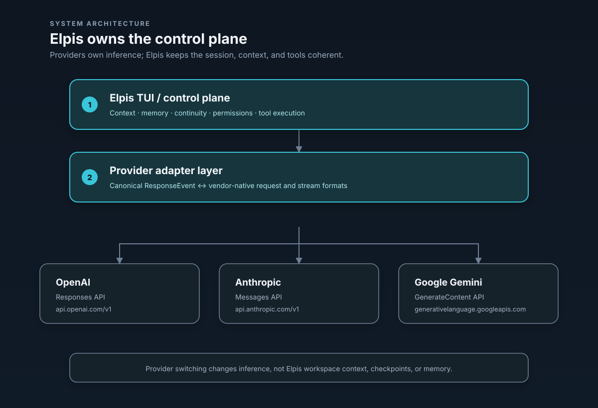

# Provider-Neutral Architecture & Model Adapters

Elpis maintains a **Provider-Neutral Architecture**: Elpis owns context admission, durable memory, session continuity, permissions, tool execution, and the TUI interface. The selected provider owns inference.


---

## 1. Systemic Architecture

```text
                               +-----------------------------+
                               |     ELPIS TUI / CONTROL     |
                               | (Context, Memory, Continuity)|
                               +--------------+--------------+
                                              |
                                              v
                               +--------------+--------------+
                               |  PROVIDER ADAPTER LAYER     |
                               |  (Canonical ResponseEvent)  |
                               +------+-------+-------+------+
                                      |       |       |
                 +--------------------+       |       +--------------------+
                 |                            |                            |
                 v                            v                            v
+----------------+------------+ +-------------+--------------+ +-----------+----------------+
| OpenAI Responses API        | | Anthropic Messages API     | | Gemini GenerateContent API   |
| Base: api.openai.com/v1     | | Base: api.anthropic.com/v1 | | Base: generativelanguage...  |
| Header: Authorization Bearer| | Header: x-api-key          | | Header: x-goog-api-key       |
+-----------------------------+ +----------------------------+ +----------------------------+
```

---

## 2. Supported Provider Routes & Protocols

| Provider ID | API Base URL | Credential Env Variable | Native Wire Protocol | Default Model |
| :--- | :--- | :--- | :--- | :--- |
| `openai` | `https://api.openai.com/v1` | `OPENAI_API_KEY` / OAuth | OpenAI Responses API | `gpt-5.4` |
| `openrouter` | `https://openrouter.ai/api/v1` | `OPENROUTER_API_KEY` | OpenAI Responses Compatibility | `openai/gpt-5.4` |
| `anthropic` | `https://api.anthropic.com/v1` | `ANTHROPIC_API_KEY` | Anthropic Messages API | `claude-sonnet-4-6` |
| `google-gemini` | `https://generativelanguage.googleapis.com/v1beta` | `GEMINI_API_KEY` | Gemini GenerateContent API | `gemini-3.5-flash` |
| `amazon-bedrock` | `https://bedrock-mantle.us-east-1.api.aws/openai/v1` | AWS credentials | OpenAI Responses API | `openai.gpt-5.*` model IDs |
| `ollama` | `http://localhost:11434/v1` | none | OpenAI Responses API | served locally |
| `lmstudio` | `http://localhost:1234/v1` | none | OpenAI Responses API | served locally |

`ollama` and `lmstudio` point at a local inference server, so no key is required and no request leaves the machine. Their port and base URL can be overridden with the experimental `CODEX_OSS_PORT` and `CODEX_OSS_BASE_URL` environment variables (`codex-rs/model-provider-info/src/lib.rs`).

---

## 2.1 Bring Your Own Key (BYOK) & Zero-API Local Testing

Elpis supports **Bring Your Own Key (BYOK)** across all major foundation providers and local engines. Setting environment variables or selecting model IDs dynamically switches active provider routing and UI display.

### 1. Bring Your Own Key (BYOK) Setup

- **Anthropic / Claude:**
  ```bash
  export ANTHROPIC_API_KEY="sk-ant-..."
  elpis --model claude-3-7-sonnet-20250219
  ```
- **OpenRouter (All Models / Universal Routing):**
  ```bash
  export OPENROUTER_API_KEY="sk-or-..."
  elpis --model anthropic/claude-3.7-sonnet
  ```
- **Google Gemini:**
  ```bash
  export GEMINI_API_KEY="..."
  elpis --model-provider google-gemini --model gemini-2.5-pro
  ```
- **OpenAI API Key:**
  ```bash
  export OPENAI_API_KEY="sk-proj-..."
  elpis --model gpt-4o
  ```

### 2. Testing UI Model Banner Without Paid API Keys

You can verify model switching, UI model banner rendering, and TUI state changes without an active paid API key using any of the following:

1. **Local Engines (Ollama / LMStudio - No API Key Required):**
   ```bash
   elpis --model-provider ollama --model llama3
   # or
   elpis --model-provider lmstudio --model local-model
   ```
2. **OpenRouter Free Tier Models:**
   ```bash
   elpis --model tencent/hy3:free
   ```
3. **Interactive TUI Model Picker:**
   Inside Elpis, type `/model` at any time to open the model & reasoning tier picker and verify that the active model name updates immediately in the upper header banner.

## 3. Provider Wire Protocol Translation

Elpis translates canonical turn objects into vendor-native HTTP payloads and translates vendor stream chunks back into unified `ResponseEvent` streams (`codex-rs/core/src/chat_completions.rs`):

| Canonical Elpis Event | OpenAI Responses | Anthropic Messages | Gemini GenerateContent |
| :--- | :--- | :--- | :--- |
| **System Rules / Prompt** | `instructions` / `system` | `system` array | `systemInstruction` object |
| **User Message** | `user` role item | `user` role content block | `user` role `parts` |
| **Assistant Message** | `assistant` role item | `assistant` role content block | `model` role `parts` |
| **Tool Declaration** | `tools` JSON schema | `tools` JSON schema | `tools.functionDeclarations` |
| **Tool Call Output** | `function_call` item | `tool_use` block | `functionCall` part |
| **Tool Result Input** | `function_call_output` | `tool_result` block | `functionResponse` part |
| **Header Auth** | `Authorization: Bearer <key>` | `x-api-key: <key>` | `x-goog-api-key: <key>` |

---

## 4. Compatibility Launcher Aliases

`--provider` accepts ten values in total: the direct routes `openai`, `openrouter`, `anthropic`, `google-gemini`, `amazon-bedrock`, `ollama`, and `lmstudio`, plus three compatibility aliases that route through OpenRouter:

| Launcher Command | Actual Provider | Model Target | Description |
| :--- | :--- | :--- | :--- |
| `--provider anthropic` | `anthropic` | `claude-sonnet-4-6` | **Direct Native** Anthropic API routing |
| `--provider google-gemini` | `google-gemini` | `gemini-3.5-flash` | **Direct Native** Google Gemini API routing |
| `--provider claude` | `openrouter` | `~anthropic/claude-sonnet-latest` | OpenRouter compatibility route |
| `--provider gemini` | `openrouter` | `~google/gemini-pro-latest` | OpenRouter compatibility route |
| `--provider gemini-flash` | `openrouter` | `~google/gemini-flash-latest` | OpenRouter compatibility route |

---

## 5. Security & Authentication Isolation

1. **Credential Isolation:** Credentials are read strictly from their designated environment variable (`OPENAI_API_KEY`, `ANTHROPIC_API_KEY`, `GEMINI_API_KEY`, `OPENROUTER_API_KEY`). Native keys are never forwarded to OpenRouter or cross-contaminated.
2. **Provider Switch Mobility:** Switching providers (`/model`) changes the active inference engine, but **does not discard Elpis workspace context, GOAL.md, ES.md checkpoints, or memory state**.

Anthropic sends its key only as `x-api-key` along with `anthropic-version: 2023-06-01`; Gemini sends its key only as `x-goog-api-key`; OpenAI and OpenRouter keep `Authorization: Bearer`.

---

## 6. Stream Translation Behavior

Beyond the request/response mapping above, the native adapters also translate streamed text, tool calls, vendor errors, token usage, model and version identifiers, and completion state back into the unified event stream. Dropping the response stream cancels the parser and releases the upstream response body, and provider stream-idle timeouts surface as stream errors.

The static native catalogs are supplied to the model manager, so `/model` uses the native provider's own default model instead of attempting an OpenAI `/models` request.

---

## 7. Honest Protocol Limitations

The native boundary rejects unsupported history and tool shapes rather than silently approximating them.

- Text and function tools are supported. Image inputs and image-bearing tool results are rejected, even though both vendors have image-capable APIs.
- OpenAI Responses-only items — encrypted reasoning state, remote compaction controls, custom/freeform tools, tool-search items, built-in web search, image generation, and namespace tools — are not translated.
- Vendor-native thinking/reasoning signatures, citations, prompt-cache controls, structured-output strictness, Anthropic server tools, and Gemini built-in tools/code execution are not preserved.
- Anthropic requests use an explicit `max_tokens` of 8192, because the canonical request has no provider-neutral output-token limit.
- Gemini emits only the first candidate. Repeated full function-call chunks are de-duplicated.
- The canonical completion event exposes `end_turn`, not a raw vendor finish-reason. Known finish reasons are mapped explicitly; unknown ones remain unknown. A parsed tool call always maps to `end_turn = false`.
- Native stream reconnection is not attempted after partial output. HTTP and SSE failures go to the existing provider error path.
- Live vendor acceptance of both native adapters is still pending.

---

## 8. Manual Smoke Tests

Anthropic:

```sh
export ANTHROPIC_API_KEY='...'
cargo run -p codex-tui --bin elpis -- --provider anthropic
# In the TUI: run /model and confirm Claude Sonnet 4.6 is listed, then ask for a simple
# answer and a task that invokes a local function tool.
```

Gemini:

```sh
export GEMINI_API_KEY='...'
cargo run -p codex-tui --bin elpis -- --provider google-gemini
# In the TUI: run /model and confirm Gemini 3.5 Flash is listed, then exercise text and a
# function-tool turn.
```

Compatibility route:

```sh
export OPENROUTER_API_KEY='...'
cargo run -p codex-tui --bin elpis -- --provider claude
# Confirm logs/config show model_provider=openrouter and the compatibility model alias.
```

Do not run these on the maintainer's workstation; use the remote Rust workflow.
