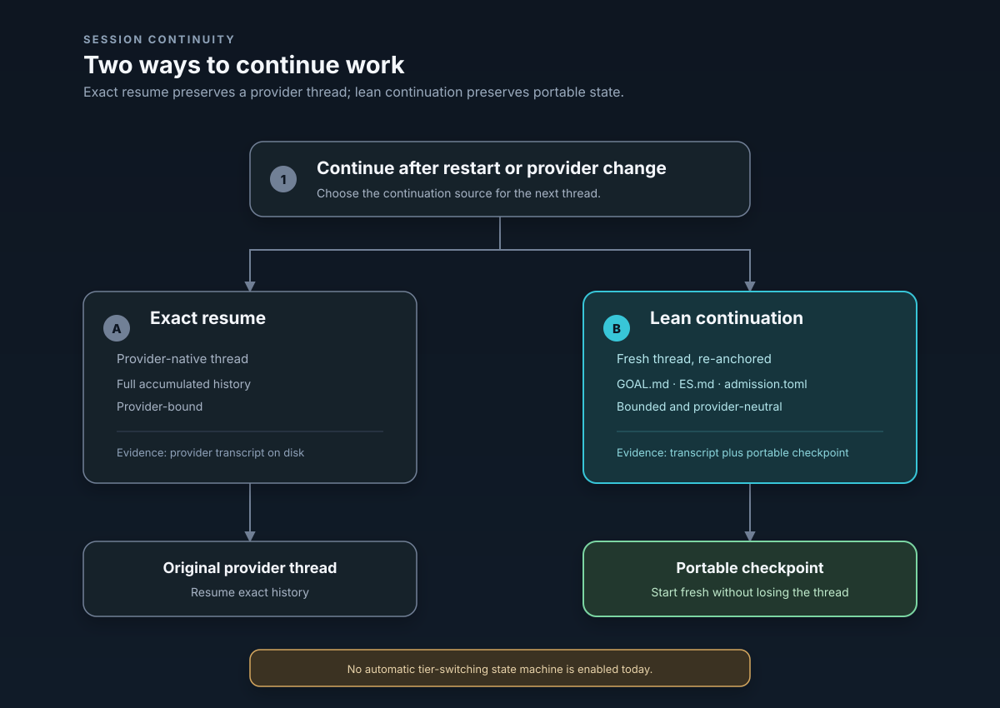

# Session Continuity

Elpis keeps work, goals, decisions, and evidence alive across restarts, model switches, and thread compaction without forcing the model to re-read an ever-growing transcript.


---

## 1. Two Continuation Modes

Elpis separates the model provider's native thread from its own provider-neutral session state, which gives two ways to continue work:

| | Exact resume | Lean continuation |
| :--- | :--- | :--- |
| **What continues** | The provider's native thread, with its accumulated history. | A fresh thread, re-anchored from portable checkpoints. |
| **History source** | Full native thread history (`thread_id`). | `GOAL.md` + `ES.md` + applicable rule files. |
| **Token footprint** | Grows with raw turn history until compaction. | Bounded by the per-source character caps in `codex-rs/core/src/elpis_context.rs`. |
| **Provider mobility** | Bound to the originating provider thread. | Provider-neutral — the checkpoint is plain Markdown. |
| **Evidence** | Provider transcript on disk. | Provider transcript on disk, plus the checkpoint. |

> **Open decision.** The threshold at which Elpis should switch automatically from exact resume to lean continuation is listed under Deferred Decisions in [`GUIDE.md`](https://github.com/MasihMoafi/Elpis/blob/main/docs/GUIDE.md). Today the portable checkpoint is contributed to thread context on every thread start; there is no automatic tier-switching state machine.

---

## 2. How Lean Continuation Is Delivered

Continuity is a context contribution, not a separate replay path. `ElpisContinuityExtension` (`codex-rs/app-server/src/extensions.rs`) implements `ContextContributor`; on thread context assembly it calls `build_continuity_prompt` (`codex-rs/core/src/elpis_context.rs`) and injects the result as a separate developer prompt fragment.

`build_continuity_prompt` reads only the sources currently admitted in the Context Ledger, so anything you toggle off in the ledger stops being carried forward on the next turn.

---

## 3. Portable Checkpoint Layout

Portable session state lives independently of provider threads:

```text
~/.elpis/context/workspaces/<workspace>/
├── GOAL.md          # Active objective for this workspace
├── ES.md            # Session checkpoint, rewritten after each completed turn
└── admission.toml   # Per-source admission flags driven by the Context Ledger
```

The `<workspace>` segment is a slug derived from the working directory plus a short hash, so separate checkouts never share a checkpoint.

### `GOAL.md`

Written by `write_goal` (`codex-rs/tui/src/elpis_context.rs`):

```markdown
# Elpis Goal

- Workspace: `/path/to/project`
- Thread: `<thread_id>`
- Status: <status>
- Updated: <unix_timestamp>

## Objective

<objective text>
```

### `ES.md`

Written by `write_session_checkpoint` in the same module, from the completed turn's own items — command executions and patch applications — rather than from a model-generated summary:

```markdown
# Elpis Session Checkpoint

- Workspace: `/path/to/project`
- Thread: `<thread_id>`
- Turn: `<turn_id>`
- Status: <status>
- Updated: <unix_timestamp>
- Goal: [GOAL.md](GOAL.md) when present

## Latest Result

<final agent message for the turn, or "No final agent result was recorded.">

## Changed Files

- `path/to/file.rs` (modified)

## Commands

- `cargo test` (exit 0)

## Exact Evidence

- Full turn remains in the provider transcript.
```

Both files are written to a temporary path and renamed into place, so a crash mid-write cannot leave a truncated checkpoint.

---

## 4. Failure Behavior

If writing `ES.md` fails, the turn still completes: Elpis logs a warning and surfaces `Turn completed, but Elpis could not save ES.md: <error>` in the transcript (`codex-rs/tui/src/app/app_server_events.rs`). Continuity degrades visibly rather than silently, but it does not abort the turn.


---

## 5. Related Surfaces

- **Context admission** — which checkpoint sources are carried forward is controlled in the Context Ledger; see [Context](context.md).
- **Memory** — durable cross-session facts live in `MEMORY.md`, switchable in the Context Ledger.
- **Providers** — because checkpoints are plain Markdown, switching provider mid-task does not discard them; see [Providers](providers.md).
