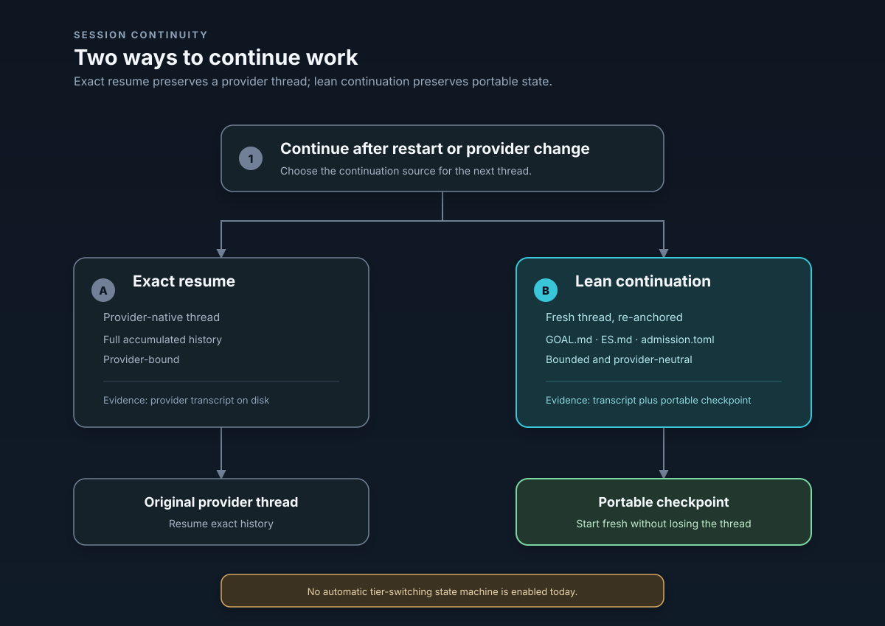

# Session Continuity

Elpis keeps work, goals, decisions, and evidence alive across restarts, model switches, and thread compaction without forcing the model to re-read an ever-growing transcript.
---

## 1. Two Continuation Modes

Elpis separates the model provider's native thread from its own provider-neutral session state, which gives two ways to continue work:

| | Exact resume | Lean continuation |
| :--- | :--- | :--- |
| **What continues** | The provider's native thread, with its accumulated history. | A fresh thread, re-anchored from an explicitly selected portable checkpoint. |
| **History source** | Full native thread history (`thread_id`). | Explicitly admitted `GOAL.md` / `ES.md` + applicable rules. |
| **Token footprint** | Grows with raw turn history until compaction. | Bounded by the per-source character caps in `codex-rs/core/src/elpis_context.rs`. |
| **Provider mobility** | Bound to the originating provider thread. | Provider-neutral — the checkpoint is plain Markdown. |
| **Evidence** | Provider transcript on disk. | Provider transcript on disk, plus the checkpoint. |

> **Open decision.** The threshold at which Elpis should switch automatically from exact resume to lean continuation is listed under Deferred Decisions in [`GUIDE.md`](https://github.com/MasihMoafi/Elpis/blob/main/docs/GUIDE.md). There is no automatic tier-switching state machine.

---

## 2. How Lean Continuation Is Delivered

Continuity is a context contribution, not a separate replay path. `ElpisContinuityExtension` (`codex-rs/core/src/elpis_admission.rs`) contributes one replaceable World State developer section before every turn and calls `build_continuity_prompt_with_dev_rule_roots` (`codex-rs/core/src/elpis_context.rs`) with the active thread ID as its sole generator. The section is empty when nothing is admitted, which removes any earlier continuity fragment instead of leaving stale context in the request. Guardian reviewer sessions do not receive this section.

`build_continuity_prompt_with_dev_rule_roots` reads only the sources currently admitted in the Context Ledger, so anything you toggle off in the ledger stops being carried forward on the next turn.

---



## 3. Portable Checkpoint Layout

The October 10 local candidate stores generated files at
`<runtime-home>/context/workspaces/<workspace>/threads/<thread-id>/GOAL.md` and
`ES.md`. Thread IDs use the runtime's UUID parser. The workspace key still isolates
working directories; the thread segment isolates simultaneous chats in that directory.
Admission switches and saving opt-in remain workspace preferences. Shared `MEMORY.md`
and its global writer lock stay shared.

An exact resume or model switch within the same thread finds its own files. A fresh
thread does not inherit another thread's state. To hand work to a fresh thread,
explicitly `/add` the desired checkpoint file. Ordinary repository `ES.md` files
remain ordinary optional file sources.

Existing workspace-level GOAL/ES files are never moved or overwritten. If a thread
has no generated file yet, it can read the old file only when its first `- Thread:`
header identifies that same thread. Clearing such state leaves an empty thread-local
file to prevent the old fallback from returning on resume.

### `GOAL.md`

Written by `write_goal` (`codex-rs/tui/src/elpis_context.rs`):

```markdown
# Elpis Goal

- Workspace: `/path/to/project`
- Thread: `<thread_id>`
- Status: <status>
- Updated: <unix_timestamp>

## Objective

<objective text>
```

### `ES.md`

The TUI writes completed-turn evidence using `write_session_checkpoint` in
`codex-rs/tui/src/elpis_context.rs` and buffered completed items. The file remains
plain Markdown and independent of the provider's transcript.

```markdown
# Elpis Session Checkpoint

- Workspace: `/path/to/project`
- Thread: `<thread_id>`
- Turn: `<turn_id>`
- Status: <status>
- Updated: <unix_timestamp>
- Goal: [GOAL.md](GOAL.md) when present

## Latest Result

<final agent message for the turn, or "No final agent result was recorded.">

## Changed Files

- `path/to/file.rs` (modified)

## Commands

- `cargo test` (exit 0)

## Exact Evidence

- Full turn remains in the provider transcript.
```

Both files are written to a temporary path and renamed into place, so a crash mid-write cannot leave a truncated checkpoint.

When workspace saving is explicitly enabled, the responding root agent may also
call `save_memory` before its final answer to replace ES's Consolidated State with
the current decisions, verification, blockers, and next action. The caller cannot
choose the file path. A thread-bound turn-start baseline, per-thread checkpoint lock,
size checks, and a final concurrent-edit check reject a newer checkpoint detected
before commit.
This save path is independent of Context Ledger admission and does not run in a
background model, after the response, or at a compaction boundary.

Automatic completion retains the same thread's Consolidated State and records
bounded result, file and command evidence. While an agent save holds the thread's
checkpoint lock, the TUI defers its write. A concurrent manual edit detected by the
save rejects the update; unrelated writers do not obey Elpis locks. The bridge CLI
save uses the same thread-specific storage, but currently captures its baseline at
tool invocation rather than at the start of the bridge turn.

An interrupted turn with no result or file/command evidence leaves that thread's
existing checkpoint intact. A first interruption still creates a checkpoint;
new progress replaces only that thread's file. Concurrent chats keep separate goals,
checkpoints, locks and save receipts. The shared memory lock still serializes all
Elpis memory saves, and a shared memory change invalidates older native baselines.

---

## 4. Failure Behavior

If writing `ES.md` fails, the turn still completes. The TUI surfaces
`Turn completed, but Elpis could not save ES.md: <error>`.
Continuity degrades visibly rather than silently, but it does not abort the turn.


---

## 5. Related Surfaces

- **Context admission** — which checkpoint sources are carried forward is controlled in the Context Ledger; see [Context](context.md).
- **Memory** — durable cross-session facts live in `MEMORY.md`, switchable in the Context Ledger.
- **Providers** — because checkpoints are plain Markdown, switching provider mid-task does not discard them; see [Providers](providers.md).
