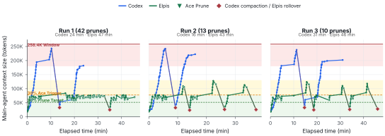
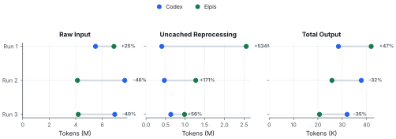
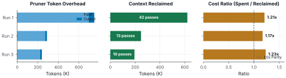

<div align="center">

# Never lose the thread.

**You run an agent inside Elpis, and it becomes Elpis.**

**Elpis is an open-source fork of OpenAI's Codex CLI that keeps the proven execution foundation while adding explicit context control, durable continuity, auditable pruning, and provider-neutral ownership around the model loop.**

[](https://github.com/MasihMoafi/Elpis/actions/workflows/embedded-elpis-linux.yml)
[](LICENSE)
[](#privacy-and-ownership)

[Install](#quickstart) • [Features](#core-features) • [Docs](#documentation)

</div>

## Quickstart

Linux x86_64 and macOS on Apple Silicon:

```bash
curl -fsSL https://raw.githubusercontent.com/MasihMoafi/Elpis/main/scripts/install-elpis.sh | bash && ~/.local/bin/elpis
```

The installer picks the right binary for your machine and installs
[RTK](https://github.com/rtk-ai/rtk), which powers shell-output filtering. On first launch,
choose a provider and sign in or enter its API key.

`v0.1.2` is the current release.

## What is Elpis

Elpis is a provider-neutral coding-agent environment. The selected model or runtime performs
inference; Elpis owns the surrounding working state: context admission, continuity, memory,
permissions, tools, evidence, and the terminal interface.

It starts from OpenAI's Apache-2.0 Codex CLI and preserves its execution foundation — terminal
UI, patches, permissions, sandboxing, sessions, and tool lifecycle — while adding a continuity-
first control layer around it. Change the provider without throwing away the project context.
Nothing about the project has to be explained twice.

Different paths. Same roots. One shared project.

## Why Elpis


<details>
<summary>Full uncut session</summary>


</details>

Long sessions fill up with transcripts, file reads, searches, command output, and dead ends.
The useful state gets buried in the story of how the agent reached it, while every request pays
for more context.

Elpis separates the active working set from durable evidence. The next request receives a small,
inspectable context; the exact record stays on disk and can be retrieved when it is needed.

### A compact evidence set

Three paired runs used one byte-identical prompt, the same model, and the same source commit on
both arms. The figures below keep the per-run observations visible rather than smoothing them
into a pooled headline. Peak context fell **47–65%** in all three runs; median context stayed
near **27% used** for Elpis while Codex climbed above 90% of the window.



The context figure's red diamonds are intentionally not one shared event type: Codex reaches a
native compaction near the window ceiling, while Elpis's 1/3/3 events are Elpis-owned
pressure-budget rollovers. The corrected audit found **0 true native compactions for Elpis in
all three runs**. Green triangles are routine Ace pruning passes.


The operating-zone view makes the central result legible at a glance: Elpis spends most requests
in the <=30% band, with short tool-burst excursions; Codex spends a large final share in the
high-pressure band before compaction.



This is a **main-agent-only** comparison. It shows the cache/reprocessing trade-off without
mixing Elpis's Ace traffic into the main-agent totals: raw input and output vary by run, while
uncached input is higher for Elpis by 56–534% in this workload.

<details>
<summary>Benchmark-era pruning workload</summary>



The pruning panel records the measured configuration behind this evaluation: 42, 13, and 10
Ace passes reclaimed 621k, 247k, and 195k context tokens, at 1.17–1.23 pruning-model tokens
spent per token reclaimed. It is useful for understanding the mechanism, **not a current cost
promise**: the evaluation records establish added model cost, latency, and possible cache-prefix
invalidation, while the current design's magnitude remains open.

</details>

See the [corrected evaluation analysis](docs/evals/analysis/final-rq1-rq4-analysis/final_analysis.md),
[metric provenance](docs/evals/analysis/provenance.csv), and [evaluation status](docs/evals/RESULTS.md)
for scope and raw-record limits.

Elpis never modifies a model's own output or a request already in flight. Pruning rewrites only
harness-supplied tool output, using a separate model instance sequenced against the main agent.
See [provider rules](docs/evals/RESULTS.md#provider-rules).

### Historical comparison screenshots

These four screenshots show a recorded Elpis/Codex comparison and make the difference concrete.
They are presentation evidence for the workflow, not a replacement for the reproducible figures
above; the original per-run records for the screenshots were not preserved.

<details>
<summary>Show the comparison screenshots</summary>

**Starting Elpis**


**Starting Codex with the same prompt**


**Elpis end state**


**Codex end state**


</details>

## Core Features

### Context engineering

Context is a budgeted working set, not a dumped transcript. Elpis makes admission visible and
uses a layered pipeline to keep useful findings while removing disposable exploration:


| Layer | What it does | When |
| --- | --- | --- |
| **1. RTK shell-output filtering** | Compacts supported command output before it reaches the model. | Before the agent sees it |
| **2. Deterministic safety cap** | Bounds exceptionally large tool results. This is inherited from Codex. | Before the agent sees it |
| **3. Ace pressure cycle** | Selectively rewrites eligible old tool evidence toward a safe working-set target, preserving the latest context and an evidence pointer. | When measured model-window use reaches the pressure threshold |

`/prune` runs the audited Ace pass on demand without rewriting user instructions, assistant
messages, or model reasoning. Elpis's `/compact` remains the conservative fallback when selective
pruning cannot reclaim enough context; the raw transcript remains durable evidence.

#### What a pruning decision looks like

One real pass from disk. A search command whose raw output ran to 18,930 characters — close to
5,000 tokens carried across requests:

**Before** — what the model was carrying:

```text
Script completed · Wall time 0.1 seconds · Output:

tui/src/external_agent_config_migration.rs:800:   item_type: …ItemType::AgentsMd,
tui/src/external_agent_config_migration_flow.rs:75: …ItemType::AgentsMd
tui/src/theme_picker.rs:283:  fn theme_picker_subtitle(home: …) -> String
tui/src/theme_picker.rs:392:     subtitle: Some(theme_picker_subtitle(
tui/src/theme_picker.rs:605:     let subtitle = theme_picker_subtitle(…, Some(200));
tui/src/theme_picker.rs:617:     let subtitle = theme_picker_subtitle(…, Some(140));
tui/src/app_event.rs:152:        OpenAgentPicker,
… roughly two hundred more lines of the same shape …
```

**After** — what the model carries now:

```text
[ELPIS CONTEXT UPDATE]
kept=`/agent` and `/subagents` already open the agent picker
     — tui/src/chatwidget/slash_dispatch.rs:305
     — preserves the selected graph UX entry point
evidence=rollout://tool-call/call_0nK3lZKWgHXkqYoNy3Sux5Gj
original_chars=18199
```

The finding survives; the noise disappears. The evidence pointer resolves to the untouched
original in the session rollout.

### Context Ledger and observability

The **Context Ledger** (`Tab`; during an active turn, `Alt+C` always toggles it) lists admitted goals, rules,
memory, and other portable sources with their byte sizes and token budgets. Toggling a row writes
`admission.toml`, which controls what the next turn receives.


`/context` answers a different question: where the window went. It displays token usage by user
messages, agent responses, tool calls, system prompt, skills, and free space, alongside available
backtrack checkpoints.


Every applied Ace pass writes an immutable audit under `~/.elpis/logs/pruning/` before model-
visible history changes. The audit records the trigger, reviewed material, per-item decisions,
before/after representations, evidence pointers, and the pruning model's usage.


### Session continuity and portability

Goals and checkpoint state survive restarts, compaction, and provider changes:


- **`GOAL.md`** persists the workspace objective.
- **`ES.md`** records the latest result, changed files, commands, verification, and exact evidence.
- **Exact resume** continues a provider-native thread when that is what you want.
- **Lean continuation** starts a fresh thread from portable Markdown checkpoints rather than replaying an ever-growing transcript.

### Memory with provenance

Durable memory is separate from session transcripts. Elpis can admit a curated `MEMORY.md` into
the working set while keeping raw conversations and terminal events as exact evidence. Memory is
plain, inspectable local state rather than opaque provider history.

### Providers, safety, and ownership

Elpis keeps provider selection explicit and translates supported native routes into one control
surface. Use OpenAI, Anthropic, Gemini, OpenRouter, Bedrock, Ollama, or LM Studio according to
the supported route and its documented limitations; switching providers does not discard Elpis'
workspace context, checkpoints, or memory.


The inherited Codex permission and sandbox controls remain visible. Read Only, Default, and Full
Access modes make commands, edits, approvals, failures, and verification inspectable rather than
hiding consequential actions behind a prompt.

### MCP integrations you plug in

Elpis does not bundle a retrieval engine, speech engine, or model weights. Optional capabilities
stay in their own processes through MCP:

- **Workspace retrieval:** [rag-mcp-lancedb](https://github.com/MasihMoafi/rag-mcp-lancedb) provides local LanceDB/Tantivy search over your documents.
- **Voice transcription:** [WhisperType](https://github.com/MasihMoafi/Voice-commander) provides local speech-to-text without adding its model/runtime dependencies to Elpis core.

### Privacy and ownership

Telemetry is off by default and no analytics are uploaded unless you explicitly configure an
exporter. Bring your own provider keys. Durable Elpis state is local files and SQLite that you
can inspect, edit, export, or delete.

## Evaluation status

The published evaluation makes narrower claims than a product demo can:

| Question | Current status |
| --- | --- |
| **RQ1 — context efficiency** | Answered for the three-run workload: peak reduction was 47–65%. |
| **RQ2 — information retention** | Established for six tested post-prune targets (6/6), not a general quality guarantee. |
| **RQ3 — task performance** | Not established; no coding-quality improvement is claimed. |
| **RQ4 — overhead and cache** | Added model cost, latency, and possible cache-prefix invalidation are established; current magnitude remains open. |
| **RQ5 — forensic auditability** | Answered: 7 of 9 reconstruction properties were fully recoverable, 2 partial, and none absent. |

## Documentation

- [Context and pruning](docs/context.md) — admission, lifetimes, pressure pruning, and audit records
- [Sessions and continuity](docs/sessions.md) — exact resume, lean continuation, `GOAL.md`, and `ES.md`
- [Providers](docs/providers.md) — provider adapters, BYOK, and protocol limitations
- [Evals & benchmarks](docs/evals/) — source data, procedures, scorers, and results
- [Technical guide](docs/GUIDE.md) — product thesis, requirements, and architecture
- [Research paper](paper/paper.md) — technical preprint and formal specifications

## License

Apache-2.0.

The execution foundation — terminal UI, patches, permissions, sandboxing, and sessions — derives
from OpenAI's Apache-2.0 Codex CLI. Elpis extends that foundation with context admission and
pruning, continuity checkpoints, auditable evidence, and provider control. Codex-derived source
retains its upstream notices under `codex-rs/`.
