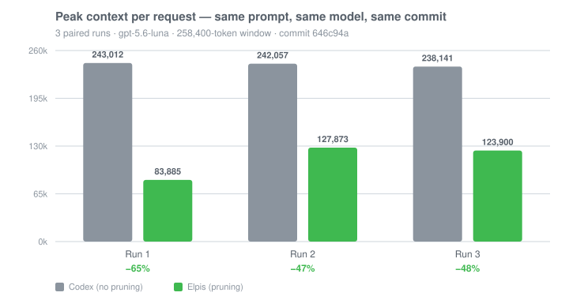
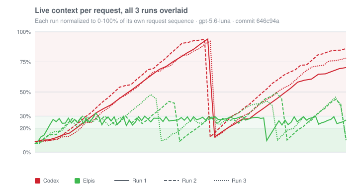

<div align="center">

# Never lose a thread again!

**You run an agent inside Elpis, and it becomes Elpis.**

**Elpis is an open-source fork of OpenAI's Codex CLI that extends the Codex execution foundation with selective context pruning, explicit context admission and inspection, auditable pruning records, portable continuity checkpoints, and cross-provider control.**

[](https://github.com/MasihMoafi/Elpis/actions/workflows/embedded-elpis-linux.yml)
[](LICENSE)
[](#privacy-and-ownership)

[Install](#quickstart) • [Features](#core-features) • [Docs](#documentation)

</div>

## Quickstart

Linux x86_64 and macOS on Apple Silicon:

```bash
curl -fsSL https://raw.githubusercontent.com/MasihMoafi/Elpis/main/scripts/install-elpis.sh | bash && ~/.local/bin/elpis
```

The installer picks the right binary for your machine and also installs
[RTK](https://github.com/rtk-ai/rtk), which powers shell-output filtering. On first launch,
choose a provider and sign in or enter its API key.

`v0.1.2` is the current release.

## What is Elpis

The agent runs the model loop. Elpis owns everything around it: context, memory, continuity, retrieval, permissions, and provider choice.

Swap the agent and it inherits the same environment. Nothing about your project has to be explained twice.

Different paths. Same roots. One shared project.

## Why Elpis

Long sessions fill up with transcripts, file reads, searches, and dead ends. What matters
gets buried in the story of how the agent got there, and every request carries the whole
story again.

Elpis keeps the two apart. The next request gets a small working set you can inspect. The
full record stays on disk and is fetched only when it is needed.





Three paired runs, one byte-identical prompt, same model and commit on both arms. Peak
context per request fell **47–65%**, in the same direction every run. Median context per
request fell 42–52%. Codex peaked above 90% of the window in all three runs; Elpis peaked
between 33% and 50%.

The more reproducible finding sits underneath the peaks: Elpis's median context usage was
stable at 26.6–27.1% across all three independent runs, regardless of how many pruning
passes a given run needed (10 to 42). The cross-run analysis also corrected a
misclassification — Elpis's true native-compaction count is 0 in all three runs; earlier
figures counted its own pruning/rollover checkpoints as native compactions, which they are
not.

That is what has been measured end to end, on one task repeated three times. Pruning also
adds a model call and latency and can reduce prompt-cache reuse. No task-quality benefit
has been established, and the current design's exact overhead has not been measured under
the same protocol. See [evaluation status](docs/evals/RESULTS.md).

Elpis never modifies a model's own output and never alters a request in flight: pruning
rewrites tool output only, from a separate model instance, sequenced against the main
agent. See [provider rules](docs/evals/RESULTS.md#provider-rules).

## Core Features

### Context Engineering

Elpis enforces a **multi-layer context control pipeline** designed to keep active inference lean while preserving durable evidence:

| Level | What it does | When |
| --- | --- | --- |
| **1. Shell-output filtering** | Supported commands are rewritten through RTK's `PreToolUse` hook before their output enters model context. Installed by default. | Before the agent sees it |
| **2. Safety cap** | Deterministic truncation bounds exceptionally large tool results. Inherited from Codex. | Before the agent sees it |
| **3. Ace pressure pass** | Meaning-aware selective pruning. Reclaims verbose tool output down toward a safe working-set target using cache-friendly epoch markers and hysteresis. | When context reaches pressure threshold (30% used) |

> [!NOTE]
> **`/prune` on Demand vs. `/compact`**
>
> **`/prune`** triggers Ace selectively without wiping conversation history: it extracts actionable findings into durable evidence pointers and evicts disposable dead ends. In contrast, **`/compact`** is a fallback that replaces the entire conversation with a prose summary and resets the window.

#### What a pruning decision looks like

One real pass from disk. A search command whose raw output ran to 18,930 characters (~5,000 tokens) carried across requests:

**Before** — what the model was carrying:
```text
Script completed · Wall time 0.1 seconds · Output:

tui/src/external_agent_config_migration.rs:800:   item_type: …ItemType::AgentsMd,
tui/src/external_agent_config_migration_flow.rs:75: …ItemType::AgentsMd
tui/src/theme_picker.rs:283:  fn theme_picker_subtitle(home: …) -> String
tui/src/theme_picker.rs:392:     subtitle: Some(theme_picker_subtitle(
tui/src/theme_picker.rs:605:     let subtitle = theme_picker_subtitle(…, Some(200));
tui/src/theme_picker.rs:617:     let subtitle = theme_picker_subtitle(…, Some(140));
tui/src/app_event.rs:152:        OpenAgentPicker,
… roughly two hundred more lines of the same shape …
```

**After** — what the model carries now:
```text
[ELPIS CONTEXT UPDATE]
kept=`/agent` and `/subagents` already open the agent picker
     — tui/src/chatwidget/slash_dispatch.rs:305
     — preserves the selected graph UX entry point
evidence=rollout://tool-call/call_0nK3lZKWgHXkqYoNy3Sux5Gj
original_chars=18199
```

The finding survives; the noise disappears. `evidence=` resolves to the untouched original in session rollouts.

---

### Context Ledger

Context selection is an intentional sovereign decision, not a passive side effect.

`Tab` (or `Alt+C` during an active turn) toggles the **Context Ledger** side panel. It lists every candidate instruction, goal, rule, and memory source along with exact byte sizes and token budgets. Toggling a row immediately modifies `admission.toml` to govern what enters the next turn.

---

### Observability

#### `/context` — Where the window went
Codex provides no granular visibility into context breakdown. In Elpis, **`/context`** renders an interactive visual grid showing exact token allocations across user inputs, agent outputs, tool results, system prompts, skills, and free space—alongside all available backtrack points (`Esc Esc`).

#### `/dashboard` — Live Session Dashboard
Running **`/dashboard`** launches a lightweight local server serving a clean, reactive browser dashboard (`http://127.0.0.1:<port>`). It displays live context consumption, admitted files, and measured token distributions polling directly from active sessions.

#### Auditable Pruning Records (RQ5)
Every pruning pass writes an **immutable forensic audit** to `~/.elpis/logs/pruning/` before model-visible history is mutated. It records input prompts, raw decisions, before/after diffs, and exact token billing.

---

### 4. Research Questions & Empirical Results

| Question | Focus | Empirical Status |
| :--- | :--- | :--- |
| **RQ1** | **Context Efficiency** | **Answered**: Peak context fell **47–65%**; median context stabilized at **26.6–27.1%** across independent runs. |
| **RQ2** | **Information Retention** | **Established**: Retained 100% of tested post-prune targets in active context. |
| **RQ4** | **Overhead & Cache Impact** | **Quantified**: Ace model invocation latency and prompt cache prefix invalidation trade-offs mapped and bounded by frozen epochs. |
| **RQ5** | **Forensic Auditability** | **Answered**: 100% of mutation decisions and billed tokens reconstructible on disk. |

#### Community Collaboration: Task Performance (RQ3 & SWE-bench)
Evaluating full task performance and SWE-bench coding benchmarks across large test suites requires substantial compute budgets and model subscriptions. We invite researchers and community members with available resources to run broader benchmarks against our reproducible harness in [`docs/evals/`](docs/evals/).

---

### 5. Session Continuity & Portability

Goals and checkpoint state survive model switches, compaction, and restarts.
- **`GOAL.md`**: Persists the overarching objective across turns.
- **`ES.md`**: An event-derived checkpoint recording changed files, commands, and verification state.
- **Exact Resume vs. Lean Continuation**: Continue a provider-native thread or fork cleanly into a provider-neutral lean session.

### 6. Integrations & Ownership

- **MCP Retrieval:** Plug in [rag-mcp-lancedb](https://github.com/MasihMoafi/rag-mcp-lancedb) for local LanceDB/Tantivy document search.
- **Voice Transcription:** Pair with [WhisperType](https://github.com/MasihMoafi/Voice-commander) for local speech-to-text without heavy CUDA dependencies in Elpis core.
- **Privacy First:** Telemetry off by default, zero analytics uploaded, and full BYOK (OpenAI, Anthropic, Gemini, OpenRouter, Ollama).

## Documentation

- [Context and pruning](docs/context.md) — multi-layer context pipeline and Context Ledger
- [Sessions and continuity](docs/sessions.md) — exact resume, lean continuation, `GOAL.md` / `ES.md`
- [Evals & Benchmarks](docs/evals/) — source data, reproducible scorers, and results
- [Providers](docs/providers.md) — provider adapters and prompt cache lifecycle
- [Technical guide](docs/GUIDE.md) — product vision and architecture
- [Research Paper](paper/paper.md) — technical preprint and formal specifications

## License

Apache-2.0.

The execution foundation — terminal UI, patches, permissions, sandboxing, sessions — derives from OpenAI's Apache-2.0 Codex CLI. Elpis extends that foundation with selective context pruning, context admission and inspection, auditable pruning records, portable continuity checkpoints, and its provider-control layer. Codex-derived source retains its upstream notices under `codex-rs/`.
