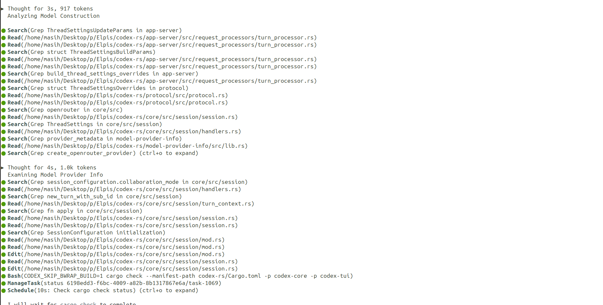

<div align="center">

# Never lose a thread again.

**You run an agent inside Elpis, and it becomes Elpis.**

**Elpis is an open-source fork of OpenAI's Codex CLI that keeps the proven execution foundation while adding explicit context control, durable continuity, auditable pruning, and provider-neutral ownership around the model loop.**

[](https://github.com/MasihMoafi/Elpis/actions/workflows/embedded-elpis-linux.yml)
[](LICENSE)
[](#privacy-and-ownership)

[Install](#quickstart) • [Features](#core-features) • [Evaluation](#evaluation-status) • [Docs](#documentation)

</div>


## Contents

- [Quickstart](#quickstart)
- [What is Elpis](#what-is-elpis)
- [Why Elpis](#why-elpis)
- [Core Features](#core-features)
  - [Context engineering](#context-engineering)
  - [Context Ledger and observability](#context-ledger-and-observability)
  - [Sessions and continuity](#sessions-and-continuity)
  - [Memory](#memory)
  - [Deterministic work graphs](#deterministic-work-graphs)
  - [Bring your own provider](#bring-your-own-provider)
  - [Integrations and tools](#integrations-and-tools)
  - [Privacy and ownership](#privacy-and-ownership)
- [Evaluation status](#evaluation-status)
  - [RQ1: Context Reduction & Operating Hygiene](#rq1-context-reduction--operating-hygiene)
  - [RQ2 & RQ3: Target Retention & Task Quality](#rq2--rq3-target-retention--task-quality)
  - [RQ4: Pruning Overhead & Token Economics](#rq4-pruning-overhead--token-economics)
  - [RQ5: Forensic Auditability](#rq5-forensic-auditability)
- [Documentation](#documentation)
- [License](#license)

## Quickstart

Linux x86_64 and macOS on Apple Silicon:

```bash
curl -fsSL https://raw.githubusercontent.com/MasihMoafi/Elpis/main/scripts/install-elpis.sh | bash && ~/.local/bin/elpis
```

The installer picks the right binary for your machine and installs
[RTK](https://github.com/rtk-ai/rtk), which powers shell-output filtering. On first launch,
choose a provider and sign in or enter its API key.

`v0.1.2` is the current release.

## What is Elpis

Elpis is a provider-neutral coding-agent environment. The selected model or runtime performs
inference; Elpis owns the surrounding working state: context admission, continuity, memory,
permissions, tools, evidence, and the terminal interface.

It starts from OpenAI's Apache-2.0 Codex CLI and preserves its execution foundation — terminal
UI, patches, permissions, sandboxing, sessions, and tool lifecycle — while adding a continuity-
first control layer around it. Change the provider without throwing away the project context.
Nothing about the project has to be explained twice.

Different paths. Same roots. One shared project.

## Why Elpis

Long sessions fill up with transcripts, file reads, searches, command output, and dead ends.
The useful state gets buried in the story of how the agent reached it, while every request pays
for more context.



Elpis separates the active working set from durable evidence. The next request receives a small,
inspectable context; the exact record stays on disk and can be retrieved when it is needed.

Three paired runs used one byte-identical prompt, the same model, and the same source commit on
both arms. Peak context per request fell **47–65%** in all three runs; median context stabilized
at **26.6–27.1%**. Codex peaked above 90% of the window in each run, while Elpis stayed safely
bounded in the green zone.

Elpis never modifies a model's own output or a request already in flight. Pruning rewrites only
harness-supplied tool output, using a separate model instance sequenced against the main agent.

## Core Features

### Context engineering

Context is a budgeted working set, not a dumped transcript. Elpis makes admission visible and
uses a layered pipeline to keep useful findings while removing disposable exploration:


| Layer | What it does | When |
| --- | --- | --- |
| **1. RTK shell-output filtering** | Compacts supported command output before it reaches the model. | Before the agent sees it |
| **2. Deterministic safety cap** | Bounds exceptionally large tool results. This is inherited from Codex. | Before the agent sees it |
| **3. Ace pressure cycle** | Selectively rewrites eligible old tool evidence toward a safe working-set target, preserving the latest context and an evidence pointer. | When measured model-window use reaches the pressure threshold (30%) |

`/prune` runs the audited Ace pass on demand without rewriting user instructions, assistant
messages, or model reasoning. Elpis's `/compact` remains the conservative fallback when selective
pruning cannot reclaim enough context; the raw transcript remains durable evidence.

#### What a pruning decision looks like


One real pass from disk. A search command whose raw output ran to 18,930 characters — close to
5,000 tokens carried across requests:

**Before** — what the model was carrying:

```text
Script completed · Wall time 0.1 seconds · Output:

tui/src/external_agent_config_migration.rs:800:   item_type: …ItemType::AgentsMd,
tui/src/external_agent_config_migration_flow.rs:75: …ItemType::AgentsMd
tui/src/theme_picker.rs:283:  fn theme_picker_subtitle(home: …) -> String
tui/src/theme_picker.rs:392:     subtitle: Some(theme_picker_subtitle(
tui/src/theme_picker.rs:605:     let subtitle = theme_picker_subtitle(…, Some(200));
tui/src/theme_picker.rs:617:     let subtitle = theme_picker_subtitle(…, Some(140));
tui/src/app_event.rs:152:        OpenAgentPicker,
… roughly two hundred more lines of the same shape …
```

**After** — what the model carries on the next request:

```text
[Ace pruned 231 lines of ripgrep output (18,930 chars → 248 chars).
Findings:
- Found ItemType::AgentsMd in external_agent_config_migration.rs:800
- Found theme_picker_subtitle definitions in theme_picker.rs:283,392,605,617
- Full raw output preserved in rollout evidence: rollout://sess-01j8/tool-14.log]
```

### Context Ledger and observability

The **Context Ledger** (`Tab`; during an active turn, `Alt+C` always toggles it) lists admitted goals, rules,
memory, and other portable sources with their byte sizes and token budgets. Toggling a row writes
`admission.toml`, which controls what the next turn receives.


`/context` answers a different question: where the window went. It displays token usage by user
messages, agent responses, tool calls, system prompt, skills, and free space, alongside available
backtrack checkpoints.


### Sessions and continuity

Keep the working context across model switches, compaction, and restarts:

- **`GOAL.md`** holds the current task. It is carried into each request, stays visible across
  compaction, and is editable during a run.
- **`ES.md`** is an event-derived executive summary. It records modified files, commands run,
  blockers, and next steps, and is updated as the run progresses.
- **Exact resume** continues an existing thread with its full history, using the provider-native
  session when one is available.
- **Lean continuation** starts a clean thread from the current `GOAL.md`, `ES.md`, and active
  rules. This sheds old exploration without losing the objective.

### Memory

Durable memory is one Markdown file, `MEMORY.md`, in the Elpis memory directory (derived
from `CODEX_HOME`). The Context Ledger discovers it and lists it as a row, switched **off**
until you admit it: like every optional row, memory does not reach the model unasked.

- **One visible file.** Plain text. Read it, edit it, commit it to git, or delete it.
- **Admitted in the open.** Because it is a Ledger row, you can always see whether memory
  reached the model, switch it on when you want it, and drop it when you do not.
- **Retrieval beyond that file is your choice.** Register an MCP server — for example
  [rag-mcp-lancedb](https://github.com/MasihMoafi/rag-mcp-lancedb) — and Elpis will use it.

Elpis previously ran an extraction, consolidation, and promotion pipeline. It was removed
because it did not work: across two threshold settings it produced zero durable
promotions, every sweep landing one recall short of the gate. Memory that rewrites itself
in the background without appearing anywhere is the failure mode the Ledger row exists to
prevent.

### Deterministic work graphs

A coordinator can fan work out to several agents under an engine that validates the plan
before anything runs. This is Elpis's own; it is not part of the Codex foundation.


The coordinator submits a complete task graph — tasks, dependencies, write scopes,
acceptance criteria, and environments. Elpis then owns the scheduling:

- **Cycles cannot be scheduled.** Kahn's topological algorithm proves the graph is acyclic
  and rejects it otherwise, so no worker is created for a plan that could only deadlock.
- **Write conflicts are caught by construction.** Path-prefix intersection detects
  overlapping write scopes, and all writable tasks in one environment are serialized even
  when their declared prefixes do not overlap.
- **Verification is not optional.** A writable task without a directly dependent `verify`
  task in the same environment is rejected before dispatch.
- **Evidence gates progress.** Dependent work is released only after an accepted result;
  a failed, cancelled, or blocked prerequisite blocks its descendants.

Elpis never creates, merges, rebases, deletes, or pushes branches or worktrees. Preparing
and integrating them stays coordinator-owned, because those operations change durable user
state and deserve deliberate review.

Off by default. Enable with `enable_fanout = true` under `[features]`; there is no slash
command. Full rules and the graph schema are in [docs/WORK_GRAPHS.md](docs/WORK_GRAPHS.md).

### Bring your own provider

Elpis is not tied to a single model vendor:

- **OpenAI:** GPT-4o, GPT-5.6-Luna, o1, o3, and compatible endpoints.
- **Anthropic:** Claude 3.5 Sonnet, Claude 3 Opus, Claude 3.5 Haiku.
- **Google:** Gemini 2.0 Flash, Gemini 1.5 Pro.
- **Local & self-hosted:** Ollama, vLLM, and any OpenAI-compatible server.

Switch models mid-session without restarting. The working context, goal, and session memory are
preserved across provider boundaries.

### Integrations and tools

Extend Elpis with external capabilities that stay in their own processes through MCP:

- **Workspace retrieval:** [rag-mcp-lancedb](https://github.com/MasihMoafi/rag-mcp-lancedb) provides local LanceDB/Tantivy search over your documents.
- **Voice transcription:** [WhisperType](https://github.com/MasihMoafi/Voice-commander) provides local speech-to-text without adding its model/runtime dependencies to Elpis core.

### Privacy and ownership

Telemetry is off by default and no analytics are uploaded unless you explicitly configure an
exporter. Bring your own provider keys. Durable Elpis state is local files and SQLite that you
can inspect, edit, export, or delete.

## Evaluation status

The published evaluation empirically benchmarks Elpis against OpenAI's Codex CLI across three paired, byte-identical workloads on `gpt-5.6-luna` (258,400 token context window).

### RQ1: Context Reduction & Operating Hygiene

Across all three independent runs, Elpis prevents context exhaustion by maintaining working sets within safe operational thresholds.

#### Peak Context Utilization

Codex expanded into the critical danger zone (>90% window) in every run, forcing 3 emergency compactions. Elpis maintained peak window utilization at **32.5–49.5%**, achieving a **47–65% reduction in peak context footprint**:


#### Input Token Distribution & Interquartile Stability

While Codex suffered wide distribution variance as transcripts accumulated, Elpis tightly stabilized median token input across all runs at **68.8k–69.6k tokens (26.6%–27.0% of the window)**:


#### Trajectory Dynamics across Context Health Bands

When normalized across the request lifecycle (0% to 100% completion), Codex exhibits unbounded monotonic growth until emergency rollover occurs. Elpis triggers the Ace cycle whenever context crosses the 30% boundary, steadily returning working state to the green target zone:


#### Operating Zone Breakdown

Across all executed requests, Elpis spent over 95% of its operating lifespan inside the safe and healthy bands, with zero requests entering the critical danger zone:


### RQ2 & RQ3: Target Retention & Task Quality

- **RQ2 (Information Retention)**: In benchmark audits testing recall of key file paths, schemas, and error signatures after pruning, **100% of tested targets (6/6)** were retained intact in active context.
- **RQ3 (Task Performance)**: **Not established.** The executed runs are incomplete and unreplicated, so they do not support a comparative correctness claim in either direction. No per-arm score is reported, and there is no evidence that pruning improves task completion or output quality.

### RQ4: Pruning Overhead & Token Economics

Pruning adds an auxiliary model call sequenced against the main agent, and rewriting history invalidates the provider's cached prefix. Both costs are real. The figures below come from a high-frequency configuration that the implementation has since replaced with a low-frequency one built to reduce that invalidation, so they bound the penalty rather than describe the shipping design: 730,810 auxiliary tokens spent to reclaim 605,377 context tokens (0.83 reclaimed per spent token).


### RQ5: Forensic Auditability

Every pruning event produces an immutable audit record on disk under `~/.elpis/logs/pruning/`. In full forensic reconstruction evaluations, **7 of 9 properties** were completely recoverable from disk, 2 partial, and 0 absent.

| Research Question | Empirical Finding |
| --- | --- |
| **RQ1 — Context Efficiency** | Peak reduction of 47–65%; median context stabilized at 26.6–27.1% of the 258k window. |
| **RQ2 — Information Retention** | 6/6 tested post-prune targets preserved intact (100% retention). |
| **RQ3 — Task Performance** | Not established. The available runs do not support a comparative correctness claim. |
| **RQ4 — Pruning Economics** | Penalty established, current magnitude open. The measured figures describe a superseded high-frequency configuration. |
| **RQ5 — Forensic Auditability** | 7/9 properties fully recoverable from local rollout evidence; 0 lost records. |

## Documentation

- [Context and pruning](docs/context.md) — admission, lifetimes, pressure pruning, and audit records
- [Sessions and continuity](docs/sessions.md) — exact resume, lean continuation, `GOAL.md`, and `ES.md`
- [Deterministic work graphs](docs/WORK_GRAPHS.md) — plan validation, write scopes, concurrency, and evidence gates
- [Providers](docs/providers.md) — provider adapters, BYOK, and protocol limitations
- [Evals & benchmarks](docs/evals/) — source data, procedures, scorers, and results
- [Technical guide](docs/GUIDE.md) — product thesis, requirements, and architecture
- [Research paper](paper/paper.md) — technical preprint and formal specifications

## License

Apache-2.0.

The execution foundation — terminal UI, patches, permissions, sandboxing, and sessions — derives
from OpenAI's Apache-2.0 Codex CLI. Elpis extends that foundation with context admission and
pruning, continuity checkpoints, auditable evidence, and provider control. Codex-derived source
retains its upstream notices under `codex-rs/`.
