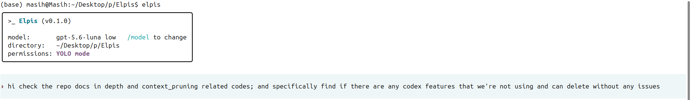
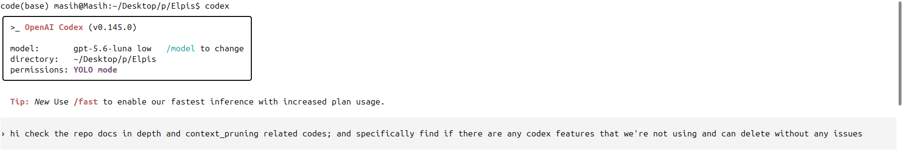
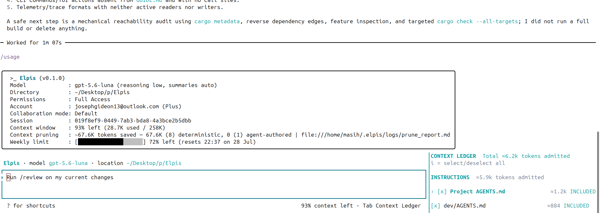
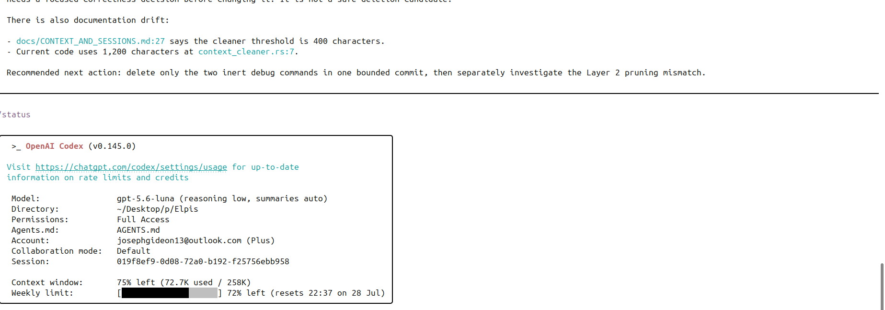
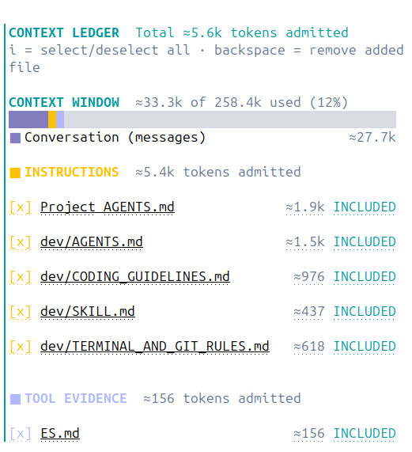
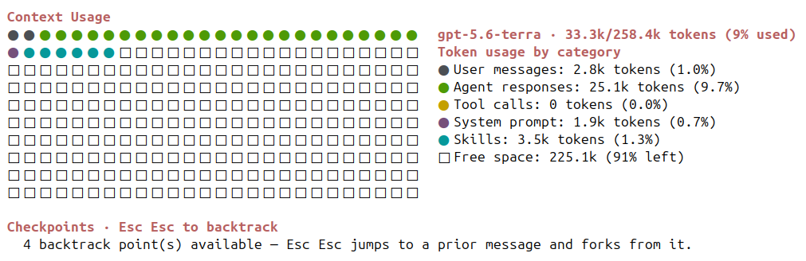

<div align="center">

# Never lose the thread.

**You run an agent inside Elpis, and it becomes Elpis.**

**Elpis is an open-source fork of OpenAI's Codex CLI that extends the Codex execution foundation with selective context pruning, explicit context admission and inspection, auditable pruning records, portable continuity checkpoints, and cross-provider control.**

[](https://github.com/MasihMoafi/Elpis/actions/workflows/embedded-elpis-linux.yml)
[](LICENSE)
[](#privacy-and-ownership)

[Install](#quickstart) • [Features](#core-features) • [Docs](#documentation)

</div>

## Quickstart

Linux x86_64 and macOS on Apple Silicon:

```bash
curl -fsSL https://raw.githubusercontent.com/MasihMoafi/Elpis/main/scripts/install-elpis.sh | bash && ~/.local/bin/elpis
```

The installer picks the right binary for your machine and also installs
[RTK](https://github.com/rtk-ai/rtk), which powers shell-output filtering. On first launch,
choose a provider and sign in or enter its API key.

`v0.1.2` is the current release.

## What is Elpis

The agent runs the model loop. Elpis owns everything around it: context, memory, continuity, retrieval, permissions, and provider choice.

Swap the agent and it inherits the same environment. Nothing about your project has to be explained twice.

Different paths. Same roots. One shared project.

## Why Elpis


<details>
<summary>Full uncut session</summary>


</details>

Long sessions fill up with transcripts, file reads, searches, and dead ends. What matters
gets buried in the story of how the agent got there, and every request carries the whole
story again.

Elpis keeps the two apart. The next request gets a small working set you can inspect. The
full record stays on disk and is fetched only when it is needed.


Three paired runs, one byte-identical prompt, same model and commit on both arms. Peak
context per request fell **47–65%**, in the same direction every run. Median context per
request fell 42–52%. Codex peaked above 90% of the window in all three runs; Elpis peaked
between 33% and 50%.

The more reproducible finding sits underneath the peaks: Elpis's median context usage was
stable at 26.6–27.1% across all three independent runs, regardless of how many pruning
passes a given run needed (10 to 42). The cross-run analysis also corrected a
misclassification — Elpis's true native-compaction count is 0 in all three runs; earlier
figures counted its own pruning/rollover checkpoints as native compactions, which they are
not.

That is what has been measured end to end, on one task repeated three times. Pruning also
adds a model call and latency and can reduce prompt-cache reuse. No task-quality benefit
has been established, and the current design's exact overhead has not been measured under
the same protocol. See [evaluation status](docs/evals/RESULTS.md).

Elpis never modifies a model's own output and never alters a request in flight: pruning
rewrites tool output only, from a separate model instance, sequenced against the main
agent. See [provider rules](docs/evals/RESULTS.md#provider-rules).

The screenshots below are historical examples of the same prompt in Elpis and Codex. The
original per-run records were not preserved, so they illustrate rather than evidence.

<details>
<summary>Historical screenshots</summary>

Start:




Example end state — Elpis:



Example end state — Codex:



</details>

## Core Features

### Context control in four layers

| Level | What it does | When |
| --- | --- | --- |
| **1. Shell-output filtering** | Supported commands are rewritten through RTK's `PreToolUse` hook, before their output ever reaches the model. The installer installs [RTK](https://github.com/rtk-ai/rtk) and Elpis registers the hook on first launch, where you trust it like any other hook. | Before the agent sees it |
| **2. Safety cap** | Deterministic truncation bounds exceptionally large tool output. Inherited from Codex, unchanged. | Before the agent sees it |
| **3. Ace steady pass** | Meaning-aware. Useful results become a compact conclusion plus an evidence pointer; dead ends leave the working context entirely. A failed pass changes nothing. | After completed work creates enough eligible output |
| **4. Ace pressure pass** | Runs the same selective process earlier, when the window reaches 30% used, and reclaims back toward 20% used. | Before context pressure harms the next turn |

`/prune` runs Ace selectively on demand while keeping the conversation intact.
`/compact` replaces the conversation with a full summary and starts a new context window.

### What a pruning decision looks like

One real pass, taken from the archive on disk. A single search command whose output ran to
18,930 characters — close to 5,000 tokens carried into every subsequent request, for one
tool call.

**Before** — what the model was carrying:

```text
Script completed · Wall time 0.1 seconds · Output:

tui/src/external_agent_config_migration.rs:800:   item_type: …ItemType::AgentsMd,
tui/src/external_agent_config_migration_flow.rs:75: …ItemType::AgentsMd
tui/src/theme_picker.rs:283:  fn theme_picker_subtitle(home: …) -> String
tui/src/theme_picker.rs:392:     subtitle: Some(theme_picker_subtitle(
tui/src/theme_picker.rs:605:     let subtitle = theme_picker_subtitle(…, Some(200));
tui/src/theme_picker.rs:617:     let subtitle = theme_picker_subtitle(…, Some(140));
tui/src/app_event.rs:152:        OpenAgentPicker,
… roughly two hundred more lines of the same shape …
```

**After** — what the model carries now:

```text
[ELPIS CONTEXT UPDATE]
kept=`/agent` and `/subagents` already open the agent picker
     — tui/src/chatwidget/slash_dispatch.rs:305
     — preserves the selected graph UX entry point
evidence=rollout://tool-call/call_0nK3lZKWgHXkqYoNy3Sux5Gj
original_chars=18199
```

The finding survives; the two hundred lines of noise do not. `evidence=` resolves to the
untouched original, still sitting in the session rollout — so a pruned session can always
be asked what it used to know. Every pass writes this record, for every item it judged.

### Every pruning decision is auditable

A forensic reconstruction audit checked, against artifacts on disk rather than source code
or design docs, whether an evaluator can rebuild what a pruning pass actually did: **7 of 9
properties fully reconstructible, 2 partial, 0 not reconstructible.** Recoverable for any
pass: when it ran and under which trigger, the exact material Ace reviewed, its per-item
keep/delete decision, the verbatim pre- and post-mutation text, and Ace's own token usage.
Partial on two counts — passes record character savings rather than exact token deltas, and
session linkage is reconstructed indirectly through item `call_id` rather than stored
directly. Full methodology, a worked example against a real pass ID, and the audit table:
[`docs/evals/rq5/FINAL_RESULTS.md`](docs/evals/rq5/FINAL_RESULTS.md).

### Context Ledger

`Tab` — or `Alt+C` while a turn is running — opens a side panel listing every source admitted into the working set, each with its size and whether it is included. Toggling a row changes what the next turn actually receives, so context selection becomes an intentional operation instead of a side effect.



### Where the window went

`/context` answers a different question: not what is admitted, but what filled the window. It shows usage as a grid broken down by category — user messages, agent responses, tool calls, system prompt, skills, free space — alongside the backtrack checkpoints you can jump to.



<details>
<summary>Full uncut session — context pruning, ledger, and /context in one recorded run</summary>


</details>

### Session continuity

Goal and checkpoint state survive compaction, model switches, and restarts, so work resumes without replaying the transcript. Exact conversations, terminal events, and artifacts remain on disk as durable evidence.

### Memory with provenance

Elpis can admit a user-maintained `MEMORY.md` into context. The automated extraction and
promotion pipeline was removed after it failed to demonstrate a real durable-memory
promotion. Elpis currently makes no automatic durable-memory claim.

### MCP integrations you plug in

Elpis ships no retrieval or speech engine and downloads no models. MCP servers keep optional capabilities in their own processes, with their own dependencies and disk costs; `/mcp` confirms the servers you register are connected.

- **Workspace retrieval:** [rag-mcp-lancedb](https://github.com/MasihMoafi/rag-mcp-lancedb) provides local semantic search and hybrid Tantivy/LanceDB retrieval over your own documents. Its embeddings, vector store, reranker, and any API key remain yours. Elpis ships no retrieval engine of its own.
- **Voice transcription:** [WhisperType](https://github.com/MasihMoafi/Voice-commander) records speech, transcribes it locally, and pastes at the active cursor. It remains an external companion; it can expose transcription as an MCP tool rather than adding Whisper, CUDA, Python, or model downloads to Elpis.

### Privacy and ownership

No analytics are uploaded, and every OpenTelemetry exporter defaults to off — telemetry is sent only if you configure an exporter yourself. Bring your own keys: use OpenAI, Anthropic, Gemini, or OpenRouter without one provider being silently routed through another. Durable state is plain files you can inspect, edit, export, or delete.

## Future development

- Windows support.
- Structured clarification and acceptance checks before difficult work.
- `/auto` model routing after it proves a real cost benefit.
- Voice input and LSP-backed code intelligence.


## Documentation

- [Context and pruning](docs/context.md) — the four context-control layers and the Context Ledger
- [Sessions and continuity](docs/sessions.md) — exact resume, lean continuation, `GOAL.md` / `ES.md`
- [Evals](docs/evals/) — source data, reproducible scorers, and publication gates
- [Providers](docs/providers.md) — every supported route, including local inference
- [Technical guide](docs/GUIDE.md) — product vision and architecture

## License

Apache-2.0.

The execution foundation — terminal UI, patches, permissions, sandboxing, sessions — derives from OpenAI's Apache-2.0 Codex CLI. Elpis extends that foundation with selective context pruning, context admission and inspection, auditable pruning records, portable continuity checkpoints, and its provider-control layer. Codex-derived source retains its upstream notices under `codex-rs/`.
