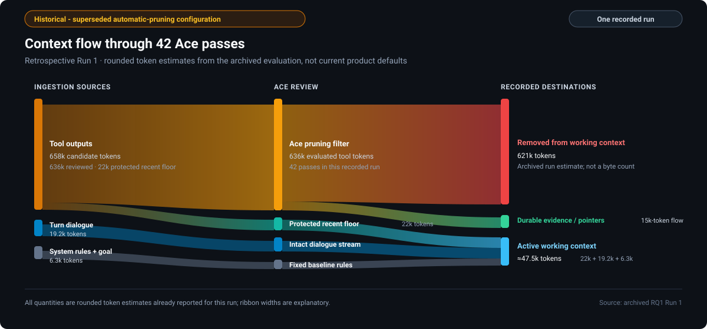
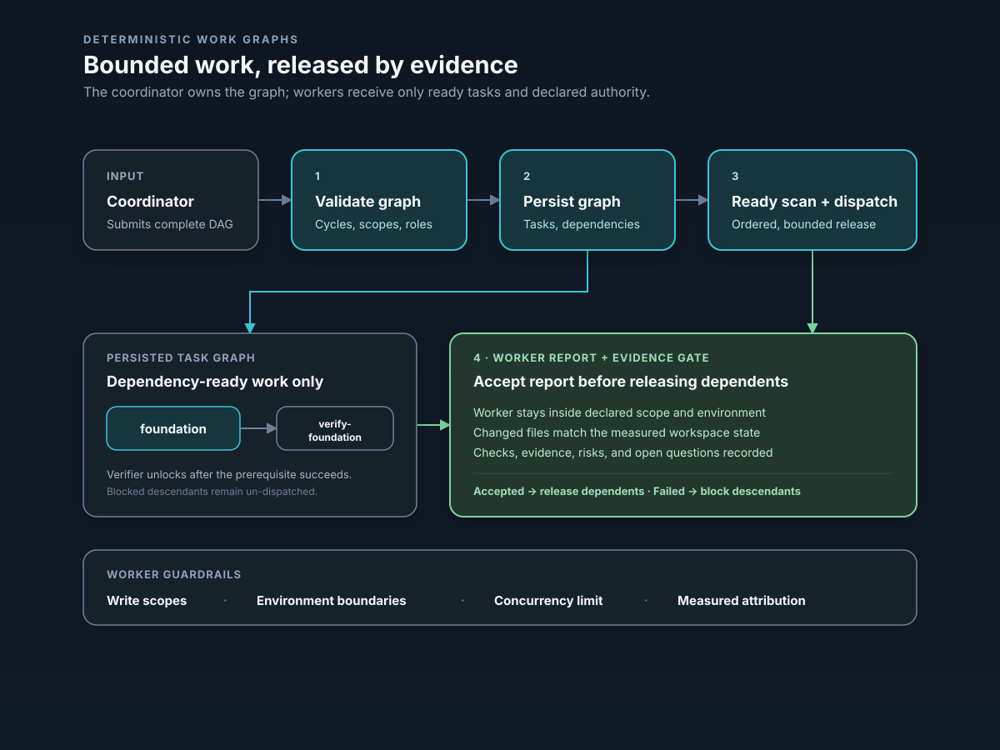
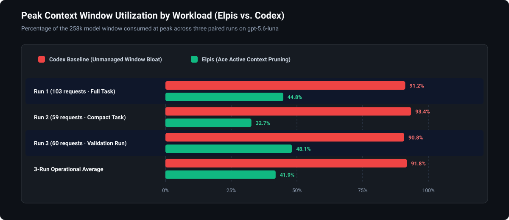
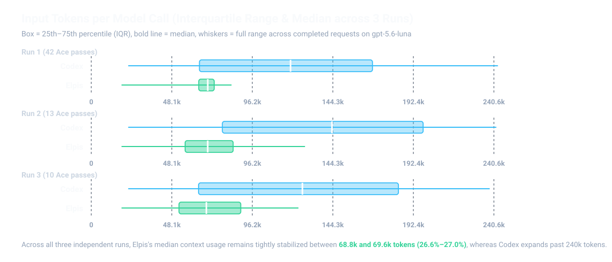
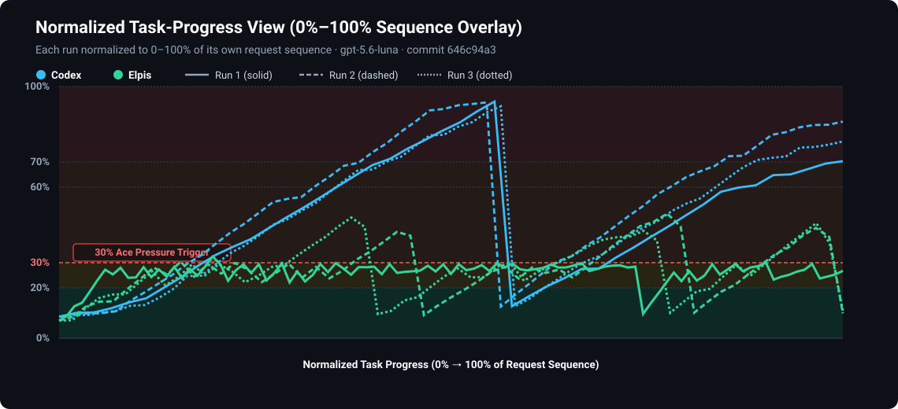
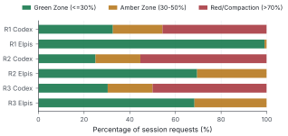
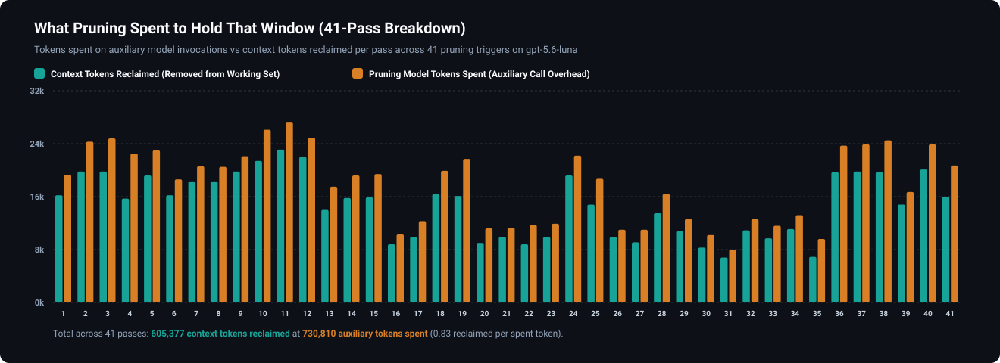

<div align="center">

# Never lose a thread again.

**You run an agent inside Elpis, and it becomes Elpis.**

**Elpis is an open-source fork of OpenAI's Codex CLI that keeps the proven execution foundation while adding explicit context control, durable continuity, auditable pruning, and provider-neutral ownership around the model loop.**

[](https://github.com/MasihMoafi/Elpis/actions/workflows/embedded-elpis-linux.yml)
[](LICENSE)
[](#privacy-and-ownership)

[Install](#quickstart) • [Features](#core-features) • [Evaluation](#evaluation-status) • [Paper](paper/paper.md) • [Docs](#documentation)

</div>

[Try the interactive Elpis demo →](https://elpis.masihmoafi.com)


## Contents

- [Quickstart](#quickstart)
- [What is Elpis](#what-is-elpis)
- [Why Elpis](#why-elpis)
- [Core Features](#core-features)
  - [Context engineering](#context-engineering)
  - [Context Ledger and observability](#context-ledger-and-observability)
  - [Sessions and continuity](#sessions-and-continuity)
  - [Memory](#memory)
  - [Deterministic work graphs](#deterministic-work-graphs)
  - [Bring your own provider](#bring-your-own-provider)
  - [Integrations and tools](#integrations-and-tools)
  - [Privacy and ownership](#privacy-and-ownership)
- [Evaluation status](#evaluation-status)
  - [RQ1: Context Reduction & Operating Hygiene](#rq1-context-reduction--operating-hygiene)
  - [RQ2 & RQ3: Target Retention & Task Quality](#rq2--rq3-target-retention--task-quality)
  - [RQ4: Cache Preservation & Token Economics](#rq4-cache-preservation--token-economics)
  - [RQ5: Forensic Auditability](#rq5-forensic-auditability)
- [Documentation](#documentation)
- [License](#license)

## Quickstart

Linux x86_64:

```bash
curl -fsSL https://raw.githubusercontent.com/MasihMoafi/Elpis/v0.1.2/scripts/install-elpis.sh | bash && ~/.local/bin/elpis
```

The installer installs Elpis only. [RTK](https://github.com/rtk-ai/rtk) is an optional,
separate shell-output filter; if it is already on `PATH`, Elpis can offer its reviewed hook
on first launch. Then choose a provider and sign in or enter its API key.

The installer downloads the [latest published Linux release](https://github.com/MasihMoafi/Elpis/releases/latest)
and verifies its SHA-256 checksum. This source describes **v0.2.0**; consult the
release page for the available artifacts and version-specific notes. The maintainer
accepted the local candidate before the hosted release gates.

## What is Elpis

Elpis is a provider-neutral coding-agent environment. The selected model or runtime performs
inference; Elpis owns the surrounding working state: context admission, continuity, memory,
permissions, tools, evidence, and the terminal interface.

It starts from OpenAI's Apache-2.0 Codex CLI and preserves its execution foundation — terminal
UI, patches, permissions, sandboxing, sessions, and tool lifecycle — while adding a continuity-
first control layer around it. Change the provider without throwing away the project context.
Nothing about the project has to be explained twice.

Different paths. Same roots. One shared project.

## Why Elpis

Long sessions fill up with transcripts, file reads, searches, command output, and dead ends.
The useful state gets buried in the story of how the agent reached it, while every request pays
for more context.

Elpis separates control of active working context from durable evidence. Portable admission
makes selected sources inspectable. When enabled and successfully applied, Smart Prune shrinks
eligible fresh tool results before first main-model exposure; source files and audit records
remain on disk.

Three paired configured historical runs with automatic pruning enabled under the superseded
high-frequency setup used one byte-identical prompt, the same model, and the same source commit
on both arms. In those runs, peak context per request fell **47–65%**; median context stabilized
at **26.6–27.0%**. Codex peaked above 90% of the window in each run, while Elpis stayed safely
bounded in the green zone.

Elpis never modifies a model's own output or a request already in flight. Pruning rewrites only
harness-supplied tool output, using a separate model instance sequenced against the main agent.

## Core Features

### Context engineering

Context is a budgeted working set, not a dumped transcript. Elpis makes admission visible and
uses a layered pipeline to keep useful findings while removing disposable exploration:


| Layer | What it does | When |
| --- | --- | --- |
| **1. RTK shell-output filtering** | Compacts supported command output before it reaches the model. | Before the agent sees it |
| **2. Deterministic safety cap** | Bounds exceptionally large tool results. This is inherited from Codex. | Before the agent sees it |
| **3. Smart Prune — Experimental** | Shrinks eligible fresh textual tool results before their first main-model exposure while preserving the tool event and call ID. | When enabled with `/prune`, the Context Ledger `p` switch, or `/smart-prune on` |
| **4. Emergency Ace pruning** | Selectively rewrites eligible old tool evidence toward a requested working-set target, preserving the latest context and an evidence pointer. | Explicit `/force-prune <1-100>` only |

`/force-prune` is an explicit emergency Ace action and does not rewrite user instructions,
assistant messages, or model reasoning. `/prune` now only enables Smart Prune for
subsequent turns; it does not rewrite already-sent history.
`/compact` immediately runs Codex native compaction and remains independent of Ace pruning.
Automatic native compaction uses the model-window threshold and usable-window headroom. Smart
Prune is Experimental and off by default; its Ledger switch and `/smart-prune on|off` command
apply to subsequent turns without rewriting admitted history.

#### What a historical pruning decision looked like



This is one recorded pass from the superseded retrospective-pruning evaluation, not current
Smart Prune behavior. A search command whose raw output ran to 18,930 characters — close to
5,000 tokens carried across requests:

**Before** — what the model was carrying:

```text
Script completed · Wall time 0.1 seconds · Output:

tui/src/external_agent_config_migration.rs:800:   item_type: …ItemType::AgentsMd,
tui/src/external_agent_config_migration_flow.rs:75: …ItemType::AgentsMd
tui/src/theme_picker.rs:283:  fn theme_picker_subtitle(home: …) -> String
tui/src/theme_picker.rs:392:     subtitle: Some(theme_picker_subtitle(
tui/src/theme_picker.rs:605:     let subtitle = theme_picker_subtitle(…, Some(200));
tui/src/theme_picker.rs:617:     let subtitle = theme_picker_subtitle(…, Some(140));
tui/src/app_event.rs:152:        OpenAgentPicker,
… roughly two hundred more lines of the same shape …
```

**After** — what the model carries on the next request:

```text
[Ace pruned 231 lines of ripgrep output (18,930 chars → 248 chars).
Findings:
- Found ItemType::AgentsMd in external_agent_config_migration.rs:800
- Found theme_picker_subtitle definitions in theme_picker.rs:283,392,605,617
- Full raw output preserved in rollout evidence: rollout://sess-01j8/tool-14.log]
```

### Context Ledger and observability

The **Context Ledger** (`Tab`; during an active turn, `Alt+C` toggles it from the normal chat screen) lists admitted goals, rules,
memory, and other portable sources with their byte sizes and capped character-derived estimates. Toggling a row
writes `admission.toml`, which controls what the next turn receives.

Development rules are ordinary Markdown Ledger rows, not skills: newly discovered rules start included and an
explicit exclusion persists. A nonempty configured development-rule root list replaces the managed fallback; an
empty list uses it. Elpis leaves ordinary and bundled skills off by product default, while deliberate user
configuration can enable a selected skill. Enabled
skills expose compact metadata and keep their bodies lazy; `/skills` shows available candidates and their origins,
but mentions and the model-visible list contain enabled skills only. The Ledger has no skills-catalog token row;
its per-source estimates are not tokenizer measurements.


`/context` answers a different question: how full the window is. Its provider-measured
headline is separate from a rough attribution based on visible transcript and admitted files:
user messages, agent responses, tool activity, workspace instructions, development rules,
portable context, and a clearly labeled built-in/estimate gap. Historical pruning savings
appear separately and are never added to a category row.

### Sessions and continuity

Keep the working context across model switches, compaction, and restarts:

- **`GOAL.md`** holds the current task and is editable during a run. When admitted in the
  Context Ledger, it is carried into subsequent requests and stays visible across compaction.
- **`ES.md`** is an event-derived executive summary. It records modified files, commands run,
  blockers, and next steps, and is updated as the run progresses. When admitted, it is carried
  into subsequent requests.
- **Exact resume** continues an existing thread with its full history, using the provider-native
  session when one is available.
- **Lean continuation** starts a clean thread from the currently admitted `GOAL.md`, `ES.md`,
  and applicable rules. This sheds old exploration without losing the admitted objective.

### Memory

Durable memory is one Markdown file, `MEMORY.md`, in the Elpis memory directory (derived
from `CODEX_HOME`). The Context Ledger discovers it and lists it as a row, switched **off**
until you admit it: like every optional row, memory does not reach the model unasked.

- **One visible file.** Plain text. Read it, edit it, commit it to git, or delete it.
- **Admitted in the open.** Because it is a Ledger row, you can always see whether memory
  reached the model, switch it on when you want it, and drop it when you do not.
- **Retrieval beyond that file is your choice.** Register an MCP server — for example
  [rag-mcp-lancedb](https://github.com/MasihMoafi/rag-mcp-lancedb) — and Elpis will use it.

Elpis previously ran an extraction, consolidation, and promotion pipeline. It was removed
because it did not work: across two threshold settings it produced zero durable
promotions, every sweep landing one recall short of the gate. Memory that rewrites itself
in the background without appearing anywhere is the failure mode the Ledger row exists to
prevent.

### Deterministic work graphs

A coordinator can fan work out to several agents under an engine that validates the plan
before anything runs. This is Elpis's own; it is not part of the Codex foundation.



The coordinator submits a complete task graph — tasks, dependencies, write scopes,
acceptance criteria, and environments. Elpis then owns the scheduling:

- **Cycles cannot be scheduled.** Kahn's topological algorithm proves the graph is acyclic
  and rejects it otherwise, so no worker is created for a plan that could only deadlock.
- **Write conflicts are caught by construction.** Path-prefix intersection detects
  overlapping write scopes, and all writable tasks in one environment are serialized even
  when their declared prefixes do not overlap.
- **Verification is not optional.** A writable task without a directly dependent `verify`
  task in the same environment is rejected before dispatch.
- **Evidence gates progress.** Dependent work is released only after an accepted result;
  a failed, cancelled, or blocked prerequisite blocks its descendants.

Elpis never creates, merges, rebases, deletes, or pushes branches or worktrees. Preparing
and integrating them stays coordinator-owned, because those operations change durable user
state and deserve deliberate review.

Under development and off by default: the gates above are covered by negative tests on
Linux, but the feature has not yet been accepted in live use. Enable with
`enable_fanout = true` under `[features]`; there is no slash command. Full rules and the graph schema are in [docs/WORK_GRAPHS.md](docs/WORK_GRAPHS.md).

### Bring your own provider

Elpis provides routes for OpenAI and OpenAI-compatible endpoints, native Anthropic Messages,
native Gemini GenerateContent, OpenRouter, Amazon Bedrock, Ollama, and LM Studio. Model catalogs
are provider-owned and can change; Elpis does not hard-code a marketing list here.

Portable `GOAL.md`, `ES.md`, and admitted rules remain provider-neutral. Native Anthropic and
Gemini adapters are implemented, while live vendor acceptance remains open.

### Integrations and tools

Extend Elpis with external capabilities that stay in their own processes through MCP:

- **Workspace retrieval:** [rag-mcp-lancedb](https://github.com/MasihMoafi/rag-mcp-lancedb) provides local LanceDB/Tantivy search over your documents.
- **Voice transcription:** [WhisperType](https://github.com/MasihMoafi/Voice-commander) provides local speech-to-text without adding its model/runtime dependencies to Elpis core.

### Privacy and ownership

Telemetry is off by default and no analytics are uploaded unless you explicitly configure an
exporter. Bring your own provider keys. Durable Elpis state is local files and SQLite that you
can inspect, edit, export, or delete.

## Evaluation status

The published evaluation reports three paired, byte-identical configured historical workloads with automatic pruning enabled under the superseded high-frequency setup, on `gpt-5.6-luna` (258,400 token context window).

### RQ1: Context Reduction & Operating Hygiene

Across those configured historical runs, Elpis maintained working sets within safe operational thresholds.

#### Peak Context Utilization

In those configured historical runs, Codex expanded into the critical danger zone (>90% window) in every run, forcing 3 emergency compactions. Elpis maintained peak window utilization at **32.5–49.5%**, achieving a **47–65% reduction in peak context footprint**:



#### Input Token Distribution & Interquartile Stability

In those configured historical runs, Codex suffered wide distribution variance as transcripts accumulated, while Elpis tightly stabilized median token input at **68.8k–69.6k tokens (26.6%–27.0% of the window)**:



#### Trajectory Dynamics across Context Health Bands

When normalized across the request lifecycle (0% to 100% completion), Codex exhibits unbounded monotonic growth until emergency rollover occurs. The Elpis trace shown here is a configured historical run with automatic pruning enabled under the superseded high-frequency setup; it is not current default behavior:



#### Operating Zone Breakdown

Across those configured historical requests, Elpis spent over 95% of its operating lifespan inside the safe and healthy bands, with zero requests entering the critical danger zone:



### RQ2 & RQ3: Target Retention & Task Quality

- **RQ2 (Information Retention)**: In one controlled post-prune context audit, **all six planted requirements and exact values (6/6)** remained intact in active context.
- **RQ3 (Task Performance)**: **Not established.** The executed runs are incomplete and unreplicated, so they do not support a comparative correctness claim in either direction. No per-arm score is reported, and there is no evidence that pruning improves task completion or output quality.

### RQ4: Cache Preservation & Token Economics

Smart Prune now optimizes a fresh tool result before first main-model exposure, so its automatic path does not rewrite already-sent history. One normal-work ON session reported 95.85% cached input overall; the first responses linked to two admissions reported 98.96% and 98.89%. Encoded-request tests separately establish stable prefix and cache-key construction on the tested path. This supports the cache-preserving mechanism, not a complete RQ4 result: there was no matched OFF arm or private full-request trace. The pilot also exposed a 45-second-timeout retry storm; in focused tests, the current code skips later Smart Prune batches in a turn after its first optimizer failure, but that fix has not yet been live-revalidated. The chart below is the 41-pass cost breakdown from the superseded 42-pass retrospective run, not current Smart Prune economics. See the [technical preprint](paper/paper.md), [mechanism-test record](docs/evals/tasks/smart_prune_cache_validation/2026-09-02-mechanism-tests.md), and [2026-09-01 live pilot](docs/evals/tasks/smart_prune_cache_validation/2026-09-01-live-pilot.md).

The separate [September 5 live smoke](docs/evals/tasks/smart_prune_cache_validation/2026-09-05-live-smoke.md)
also admitted one smaller output, retained a planted fact, and observed cache reuse.
It is ON-only functional evidence, not an additional controlled savings experiment.



### RQ5: Forensic Auditability

Every applied manual Ace pass writes an audit record under `~/.elpis/logs/pruning/`;
applied Smart Prune admissions use `~/.elpis/logs/smart-prune/admissions/`. In the manual
pass reconstruction evaluation, **7 of 9 properties** were completely recoverable from
disk, 2 partial, and 0 absent. The Smart Prune schema has separate focused tests and is not
covered by that 7/9 result.

| Research Question | Empirical Finding |
| --- | --- |
| **RQ1 — Context Efficiency** | Historical superseded high-frequency setup: peak reduction of 47–65%; median context stabilized at 26.6–27.0% of the 258k window. |
| **RQ2 — Information Retention** | 6/6 tested post-prune targets preserved intact (100% retention). |
| **RQ3 — Task Performance** | Not established. The available runs do not support a comparative correctness claim. |
| **RQ4 — Overhead and Cache** | Cache-preserving mechanism supported; comparative cost and latency remain open. |
| **RQ5 — Forensic Auditability** | Manual Ace schema: 7/9 properties fully recoverable from local evidence; 0 lost records. |

## Documentation

- [Context and pruning](docs/context.md) — admission, persistence, manual pruning, and audit records
- [Smart Prune and cache stability](docs/cache-friendly-pruning.md) — admission-time optimization, evidence, overhead, and open questions
- [Sessions and continuity](docs/sessions.md) — exact resume, lean continuation, `GOAL.md`, and `ES.md`
- [Deterministic work graphs](docs/WORK_GRAPHS.md) — plan validation, write scopes, concurrency, and evidence gates
- [Providers](docs/providers.md) — provider adapters, BYOK, and protocol limitations
- [Evals & benchmarks](docs/evals/) — source data, procedures, scorers, and results
- [Technical guide](docs/GUIDE.md) — product thesis, requirements, and architecture
- [Research paper](paper/paper.md) — admission-time context optimization, mechanism proof, live evidence, and limitations
- [Changelog](CHANGELOG.md) — release-level changes

## License

Apache-2.0.

The execution foundation — terminal UI, patches, permissions, sandboxing, and sessions — derives
from OpenAI's Apache-2.0 Codex CLI. Elpis extends that foundation with context admission and
pruning, continuity checkpoints, auditable evidence, and provider control. Codex-derived source
retains its upstream notices under `codex-rs/`.
