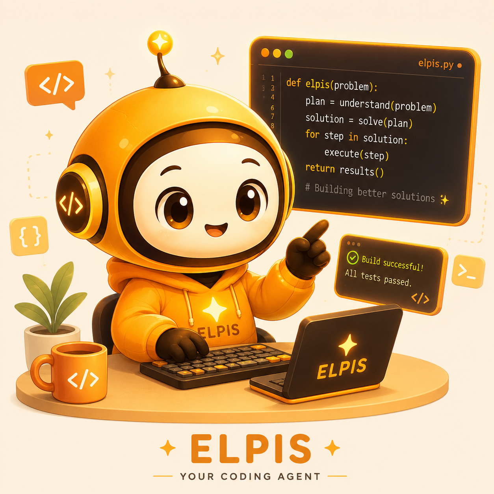
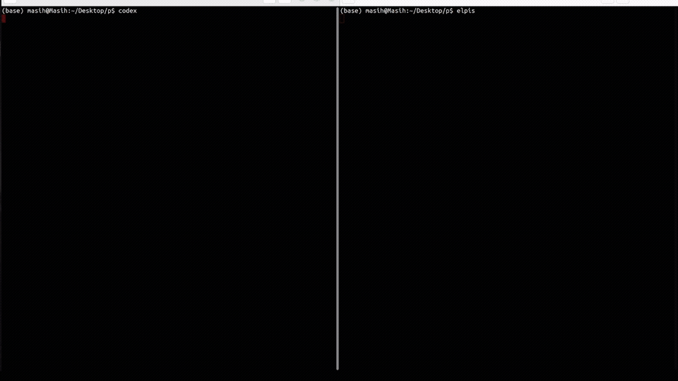
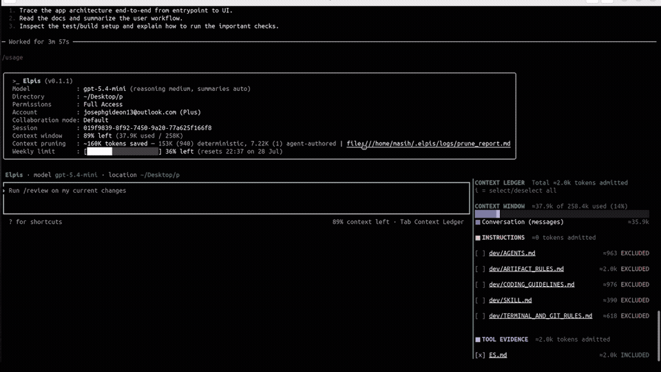

<div align="center">



<br>

**Terminal environment for coding agents that keeps the working context small.**

[](https://github.com/MasihMoafi/Elpis/actions/workflows/embedded-elpis-linux.yml)
[](https://github.com/MasihMoafi/Elpis/releases/latest)
[](LICENSE)
[](#privacy-and-ownership)

[Install](#quickstart) • [Features](#core-features) • [Docs](https://masihmoafi.github.io/Elpis/) • [Roadmap](TASKS.md)

</div>

## What is Elpis

> *You run an agent inside Elpis, and it becomes Elpis.*

The agent runs the model loop. Elpis owns everything around it — context, continuity, memory, retrieval, permissions, evidence, and explicit provider choice. Swap the agent and it inherits the same environment; nothing about your project has to be re-explained.

### Elpises

An Elpis is an agent working inside that environment. Different Elpises can research, build, test, or review along different paths while staying rooted in the same project.


Different paths. Same roots. One shared project.

## Why Elpis



<details>
<summary>Full uncut session</summary>



</details>

Long agent sessions accumulate transcripts, file reads, searches, command output, and dead ends. The useful state gets buried in the history of how the agent reached it, and every request pays for more context.

Elpis separates working context from durable evidence. The next request receives a small, inspectable working set; the exact record stays on disk and is retrieved only when it is needed.

**One controlled comparison** — same task, same prompt:

| | Free context at end |
| --- | --- |
| **Elpis** | **93%** |
| Codex | 73% |

<details>
<summary>Screenshots</summary>

Start:


End — Elpis, 93% free:


End — Codex, 73% free:


This is one recorded workflow, not a claim that every task reduces the same amount.

</details>

## Core Features

### Context pruning on three levels

| Level | What it does | When |
| --- | --- | --- |
| **1. Shell-output filtering** | Supported commands run through RTK before their output ever reaches the model. In one real investigation it removed 72–97% of three broad `rg` outputs. | Before the agent sees it |
| **2. Safety cap** | Deterministic truncation bounds exceptionally large tool output. Inherited from Codex, unchanged. | Before the agent sees it |
| **3. Ace post-turn pass** | Meaning-aware. Useful results become a compact conclusion plus an evidence pointer; dead ends leave the working context entirely. A failed pass changes nothing. | After the work is done |

Level 1 activates once you install RTK and trust its hook; levels 2 and 3 are built in. Inspect the result with `/prune`.

```text
[tool output]
     |
     v
[1. RTK filter]         optional; compact output, exact output on demand
     |
     v
[2. safety cap]         deterministic; only exceptionally large output
     |
     v
[3. active agent turn]  result stays available while the agent works
     |
     v
[4. Ace post-turn pass] meaning-aware; runs after the work is complete
     |
     +-- useful -----> compact conclusion + rollout evidence pointer
     +-- dead end ---> removed from the next working context
     +-- failure ----> original history unchanged
```

### Context Ledger

`/context` shows exactly which files are in the working set, why each one is there, and ctrl+click opens any path. Context selection becomes an intentional operation instead of a side effect.

### Session continuity

Goal and checkpoint state survive compaction, model switches, and restarts, so work resumes without replaying the transcript. Exact conversations, terminal events, and artifacts remain on disk as durable evidence.

### Memory with provenance

Reusable memory is selective, size-capped, and attributable — every entry records where it came from, and entries are promoted or archived rather than accumulating forever.

### Local knowledge base

Optional read-only semantic search over your own documents, with no write access granted to the agent. Currently available from a source checkout via `scripts/setup-rag.sh`; reaching binary installs is [tracked work](TASKS.md).

### Privacy and ownership

No analytics are uploaded, and every OpenTelemetry exporter defaults to off — telemetry is sent only if you configure an exporter yourself. Bring your own keys: use OpenAI, Anthropic, Gemini, or OpenRouter without one provider being silently routed through another. Durable state is plain files you can inspect, edit, export, or delete.

## Quickstart

Linux x86_64:

```bash
curl -fsSL https://raw.githubusercontent.com/MasihMoafi/Elpis/main/scripts/install-elpis.sh | bash && ~/.local/bin/elpis
```

On first launch, choose a provider and sign in or enter its API key.

## Future development

- Apple Silicon macOS support, followed by Windows.
- Structured clarification and acceptance checks before difficult work.
- Multi-agent controls and visible task coordination.
- `/auto` model routing after it proves a real cost benefit.
- Voice input and LSP-backed code intelligence.

Full roadmap: [TASKS.md](TASKS.md).

## Documentation

- [Context and sessions](https://masihmoafi.github.io/Elpis/context-and-sessions/)
- [Memory](https://masihmoafi.github.io/Elpis/memory/)
- [Providers](https://masihmoafi.github.io/Elpis/providers/)
- [`GUIDE.md`](GUIDE.md) — product vision and architecture
- [`TASKS.md`](TASKS.md) — release state and backlog

## License

Apache-2.0.

The execution foundation — terminal UI, patches, permissions, sandboxing, sessions — derives from OpenAI's Apache-2.0 Codex CLI. Elpis adds the context, continuity, memory, retrieval, and provider-control layer around it. Codex-derived source retains its upstream notices under `codex-rs/`.
