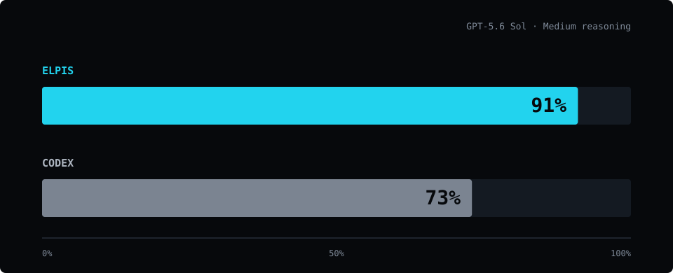
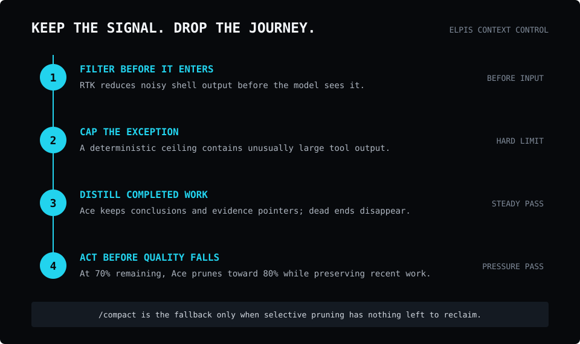

<div align="center">


<br>

# Never lose the thread.

**You run an agent inside Elpis, and it becomes Elpis.**

More **QUALITY**. More **QUANTITY**.

[](https://github.com/MasihMoafi/Elpis/actions/workflows/embedded-elpis-linux.yml)
[](LICENSE)
[](#privacy-and-ownership)

[Install](#quickstart) • [Features](#core-features) • [Docs](#documentation)

</div>

## One prompt. More room to think.

The same project-familiarization prompt was run 100 times. With GPT-5.6 Sol at Medium
reasoning, Elpis finished with **91% of its context remaining** on average, compared with
**73% for Codex**.



These are the reported aggregate results. The original per-run traces were not retained,
so the chart does not invent a per-run distribution.

### See one run

The demo below is one representative run of that prompt—not the complete 100-run dataset.


## Quickstart

Linux x86_64 and macOS on Apple Silicon:

```bash
curl -fsSL https://raw.githubusercontent.com/MasihMoafi/Elpis/main/scripts/install-elpis.sh | bash && ~/.local/bin/elpis
```

The installer picks the right binary for your machine and also installs
[RTK](https://github.com/rtk-ai/rtk), which powers shell-output filtering. On first launch,
choose a provider and sign in or enter its API key.

`v0.1.1` is the latest published release. The redesigned `/prune` and automatic pressure
policy described below are implemented on `main` but still await Masih's functional
acceptance before the next release.

## What is Elpis

> *You run an agent inside Elpis, and it becomes Elpis.*

The agent runs the model loop. Elpis owns everything around it: context, memory, continuity, retrieval, permissions, and provider choice.

Swap the agent and it inherits the same environment. Nothing about your project has to be explained twice.


Different paths. Same roots. One shared project.

## Why Elpis

Long sessions fill up with transcripts, file reads, searches, and dead ends. What matters gets buried in the story of how the agent got there, and every request pays for it.

Elpis keeps the two apart. The next request gets a small working set you can inspect. The full record stays on disk and is fetched only when it is needed.

The screenshots below are historical examples of the same prompt in Elpis and Codex.
They illustrate the setup, but they do not prove the 100-run aggregate reported above;
the original per-run records were not preserved.

A pinned, synthetic 3×10 comparison for exact recall, paraphrased recall, and negative
controls is specified in
[docs/evals/context-continuity](docs/evals/context-continuity/README.md). It has a
deterministic scorer, but no score is published because the required provider runs and
raw transcripts have not been produced.

<details>
<summary>Historical screenshots</summary>

Start:


Example end state — Elpis:


Example end state — Codex:


</details>

## Core Features

### Context control in four layers

| Level | What it does | When |
| --- | --- | --- |
| **1. Shell-output filtering** | Supported commands are rewritten through RTK's `PreToolUse` hook, before their output ever reaches the model. In one real investigation it removed 72–97% of three broad `rg` outputs. The installer installs [RTK](https://github.com/rtk-ai/rtk) and Elpis registers the hook on first launch, where you trust it like any other hook. | Before the agent sees it |
| **2. Safety cap** | Deterministic truncation bounds exceptionally large tool output. Inherited from Codex, unchanged. | Before the agent sees it |
| **3. Ace steady pass** | Meaning-aware. Useful results become a compact conclusion plus an evidence pointer; dead ends leave the working context entirely. A failed pass changes nothing. | After completed work creates enough eligible output |
| **4. Ace pressure pass** | Runs the same selective process earlier, at 70% remaining, and aims to return the session to 80% remaining. | Before context pressure harms the next turn |



`/prune` runs Ace selectively on demand while keeping the conversation intact.
`/compact` replaces the conversation with a full summary and starts a new context window.

### Context Ledger

`Tab` — or `Alt+C` while a turn is running — opens a side panel listing every source admitted into the working set, each with its size and whether it is included. Toggling a row changes what the next turn actually receives, so context selection becomes an intentional operation instead of a side effect.


### Where the window went

`/context` answers a different question: not what is admitted, but what filled the window. It shows usage as a grid broken down by category — user messages, agent responses, tool calls, system prompt, skills, free space — alongside the backtrack checkpoints you can jump to.


<details>
<summary>Full uncut session — context pruning, ledger, and /context in one recorded run</summary>


</details>

### Session continuity

Goal and checkpoint state survive compaction, model switches, and restarts, so work resumes without replaying the transcript. Exact conversations, terminal events, and artifacts remain on disk as durable evidence.

### Memory with provenance

Reusable memory is designed to be selective, size-capped, and attributable. It ships
off, matching upstream Codex. Extraction works, but durable promotion has not produced a
real `MEMORY.md` commit on Masih's install because the current recall threshold is not
reached in normal use. `/memories` controls recall and writing independently; no claim
that durable memory works is accepted without a promotion commit in the memories
repository. See [the measured state and eval](docs/memory.md).

### MCP integrations you plug in

Elpis ships no retrieval or speech engine and downloads no models. MCP servers keep optional capabilities in their own processes, with their own dependencies and disk costs; `/mcp` confirms the servers you register are connected.

- **Workspace retrieval:** [rag-mcp](https://github.com/MasihMoafi/rag-mcp) provides local semantic search over your own documents. Its embeddings, vector store, reranker, and any API key remain yours. See [docs/rag.md](docs/rag.md).
- **Voice transcription:** [Voice Commander](https://github.com/MasihMoafi/Voice-commander) records speech, transcribes it locally, and pastes at the active cursor. It remains an external companion; it can expose transcription as an MCP tool rather than adding Whisper, CUDA, Python, or model downloads to Elpis.

### Privacy and ownership

No analytics are uploaded, and every OpenTelemetry exporter defaults to off — telemetry is sent only if you configure an exporter yourself. Bring your own keys: use OpenAI, Anthropic, Gemini, or OpenRouter without one provider being silently routed through another. Durable state is plain files you can inspect, edit, export, or delete.

## Future development

- Windows support.
- Structured clarification and acceptance checks before difficult work.
- `/auto` model routing after it proves a real cost benefit.
- Voice input and LSP-backed code intelligence.


## Documentation

- [Context and pruning](docs/context.md) — the four context-control layers and the Context Ledger
- [Sessions and continuity](docs/sessions.md) — exact resume, lean continuation, `GOAL.md` / `ES.md`
- [Memory](docs/memory.md) — the two-stage pipeline, the archive, and what you control
- [Evals](docs/evals/) — source data, reproducible scorers, and publication gates
- [Providers](docs/providers.md) — every supported route, including local inference
- [Workspace retrieval](docs/rag.md) — how to plug in semantic search over your own documents
- [Technical guide](docs/GUIDE.md) — product vision and architecture

## License

Apache-2.0.

The execution foundation — terminal UI, patches, permissions, sandboxing, sessions — derives from OpenAI's Apache-2.0 Codex CLI. Elpis adds the context, continuity, memory, retrieval, and provider-control layer around it. Codex-derived source retains its upstream notices under `codex-rs/`.
